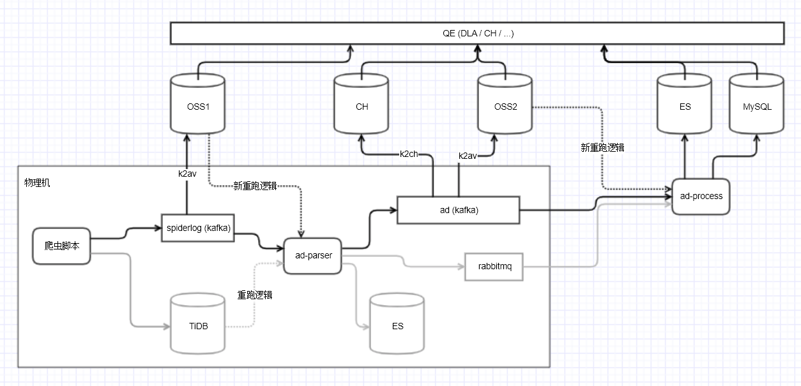

## 统一原始爬虫日志格式

jira: https://jira.umlife.net/browse/SOD-3

爬虫直接写入/调用adlog服务写入kafka队列 (json, 但是是proto定义的). 后续AG的原始日志队列格式建议改成proto, 减少不必要的请求, 并保证一致性.

MH由于目前在用爬虫较少改动起来比较简单. 前期可以通过 CrawledData -> SpiderLog 的方式来解决.

爬虫原始日志定义/OSS映射调研（AG/MH现有场景与问题，方案预估与调研）：
https://conf.umlife.net/pages/viewpage.action?pageId=74747135
https://conf.umlife.net/pages/viewpage.action?pageId=74753494
TODO: 里面提到了AVRO格式，其优缺点, Avro Codec 比较

统一proto格式: https://git.umlife.net/mt-data/commonproto/merge_requests/11

物理机Kakfa(proto)转AVRO上传到OSS的流程, 已有OSS入库广告数据, 基于DLA来调研

计算任务支持kafka来源, 以及OSS上avro文件来源

## crontab定时任务的优化
baton: 单点问题/并发控制/失败重试, 告警/日志跟踪/变更记录, 权限管理/...

## schema
基于schema项目生成业务友好的数据定义查询文档
数据变更工单和schema项目的联动

## 整合项目
项目结构： https://git.umlife.net/mt-service/py-template/merge_requests/12/diffs

PY项目统一CICD流程: lint → test → build → deploy

业务项目基于image deploy, 基于schema image做本地开发/单元测试?

日志收集监控: 日志统一输出stdout/stderr

## 监控

基础监控(grafana+prometheus), 钉钉监控

baton、supervisorctl

## 慢查询优化
完善监控, SLA拆解: 页面加载 → 接口层面监控指标 → 查询, 数据库中间件层面
短期: 业务层面缓存手段缓解(主动缓存)
长期: 新数据库, 查询引擎的调研

做的东西业务用不上, 如OSS/CH数据, 写了很多查的少

用的少的一部分原因是没啥信心: 需要做好服务监控完善, 
另一部分原因是习惯原因, 习惯了SQL查询, 新的数据源不够方便, 办法: 完善相关读取的工具

## 实际情况

分配业务需求、加强改表评审，理解业务的数据流

如何"渗透业务": 参与到具体业务开发, 承担部分模块 技术评审环节 卡数据库变更环节

## 关键词 
AVRO
monorepo
protobuf
consul
