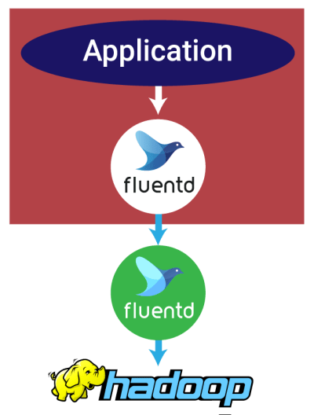

## 背景

理论上，由单体架构产生的数据很容易追踪。按定义说，系统是中心化的，它生成的日志都可以使用相同的模式格式化。微服务，就我们所知道，不是这样的。不同服务的日志有自己的模式，或者根本就没有模式可言！因此，简单地从不同的服务收集日志，再将它们转成可读的格式，是一个难以解决的数据基础架构问题。

> 在容器化的世界里，我们必须从不同的角度考虑日志记录。

### 问题:
- 传统上，日志用它们的来源服务器的 IP 地址标记。这不适用于容器，容器阻隔了固定的服务器和角色之间的映射。
- 另一个问题是日志文件的存储。容器是不可变的，用后即可丢弃的，所以存在容器里的日志会随着容器实例结束而消失。

为了使我们的数据基础架构具有可扩展性和可恢复性，有一些问题需要提前考虑。

- 网络流量。数据在所有的这些节点之间来回转发，我们需要一个“流量警察”，以确保网络不会过载或丢失数据。
- CPU 负载。在来源端解析数据和在聚合器上对其格式化是非常消耗计算资源的。同样，我们也需要一个系统来管理这些资源，防止我们的 CPU 超载。
- 冗余。弹性需要冗余。我们需要使聚合器冗余，以防止单点故障时造成数据丢失。
- 控制延迟。没有办法避免系统中的延迟。我们不能完全摆脱延迟，但我们需要控制它，这样我们才知道什么时候，系统中发生了什么。

### 聚合模式
最佳的配置是同时在来源端和目标端设置聚合器，同样，我们要权衡利弊，这样会导致有更多的节点，比之前的配置稍复杂。但是好处是显而易见的：
- 目标端的改变不会影响来源端，总体维护成本更低。
- 更好的性能。有了来源端的独立的聚合器，我们可以调整聚合器，减少对 Store 的写请求，这让我们可以选择性能和扩展问题更少的标准数据库。

不同来源的日志可能是结构化或者非结构化的格式, *收集器节点*通过将原始日志*转换*为结构化数据（例如，JSON 中的键值对，消息包或者其他标准格式。在容器里运行的收集器节点代理，将结构化的数据实时的（或者微批量的）转发到聚合器节点。*聚合器节点*的工作是将多个小的日志流组*合成*一个数据流，更容易处理和收集到 Store 节点，在那里它们将被持久化以备日后使用。

在来源端聚合的另一个好处是容错性。在现实世界中，服务器是可能宕掉的。在处理由大量微服务连续不断生成的日志时，过重的负载更可能让服务器崩溃。当这种情况发生时，在宕机期间产生的事件会永久丢失，如果你的系统宕机时间过长，即使有来源端缓冲（如果你用的日志平台有来源端缓冲 — 超过一分钟）也会溢出，导致永久性的数据丢失。目标端聚合通过增加冗余提高了容错能力。通过在容器和数据库之间多加一层，相同的数据副本会被发送给多个聚合器，而不是用并发连接过载你的数据库。

---
## fluentd 介绍

Fluentd是一个开源的数据收集器，专为处理数据流设计，有点像 syslogd ，但是使用JSON作为数据格式。它采用了插件式的架构，具有高可扩展性高可用性，同时还实现了高可靠的信息转发。

据分(Y)析(Y)，Fluentd是由Fluent+d得来，d生动形象地标明了它是以一个守护进程的方式运行。官网上将其描述为data collector，在使用上，我们可以把各种不同来源的信息，首先发送给Fluentd，接着Fluentd根据配置通过不同的插件把信息转发到不同的地方，比如文件、SaaS Platform、数据库，甚至可以转发到另一个Fluentd。

总结一下，数据流殊途，同归与Fluentd，Fluentd做一些诸如过滤、缓存、路由等工作，将其转发到不同的最终接收方。

用Fluentd处理数据还能保证一定的实时性，其提供种类丰富的客户端lib，很适合处理单位时间emit出log数量巨大的场景。

> TODO: 原理

---
## 最佳实践

### 简单转发+垂直扩展
在每个容器中启用直接把日志转发到 Fluentd 实例, 通过几个并发连接存在标准的 MySQL 数据库中。

类比：过sidecar容器直接把日志文件发送到远程存储

### 来源端聚合 + 垂直扩展
可能的配置是在来源端使用 Fluentd 聚合，并用插件，将聚合好的日志发送至一个 NoSQL 数据库存储。

类比： 在 Node 上部署 logging agent。

### 来源端／目标端聚合 + 水平扩展
如果你需要处理大量的复杂数据，最好的办法是同时在来源端和目标端设置聚合节点，利用 Fluentd 的多种设置模式。使用 Docker 附带的 Fluentd 日志驱动程序，你的应用程序可以将其日志写到 STDOUT 输出流。Docker 会自动把它们转发到本地的 Fluentd 实例上，然后按顺序聚合并通过 TCP 连接把它们再转发到目标端的 Fluentd 聚合器上。Fluentd 聚合器再同步到Store节点上。

这就是 Fluentd 强大的功能和灵活性的体现。在这种构架中，Fluentd 默认启用具有自动故障转移功能的循环负载平衡。这很适合水平扩展的架构，因为每个新节点都根据下游实例的流量负载平衡。另外，内置的缓冲存储插件能使其在传输过程中的每个阶段提自动防止数据丢失。它甚至包括自动的损坏检测（启动上传重试，直到完成全部数据传送）以及数据去重 API。

---
## k8s容器日志收集方案

### 在 Node 上部署 logging agent，将日志文件转发到后端存储里保存起来。

以 DaemonSet 的方式运行在节点上， 将宿主机上的容器日志目录挂载进去，最后由 logging-agent 把日志转发出去。只需要部署一个agent，并且不会对应用和pod有任何入侵性。要求应用输出的日志，都必须是直接输出到容器的stdout和stderr里。

集群启动时会在每个机器启动一个Fluentd agent收集日志然后发送给Elasticsearch, 实现方式是每个agent挂载目录/var/lib/docker/containers使用fluentd的tail插件扫描每个容器日志文件，直接发送给Elasticsearch。

### sidecar重新输出
  
当容器的日志只能输出到某些文件里的时候，我们可以通过一个sidecar容器把这些日志文件重新输出到sidecar的stdout和stderr。

sidecar跟主容器之间是共享Volume的，所以这里的sidecar方案的二外性能损耗并不高，也就多占用一点cpu和内存。但是，这时候宿主机上世纪会存在两份相同的日志文件：一份是应用自己写入的；另一份是sidecar的stdout和stderr对应的json文件。这对磁盘是很大的浪费。

### 通过sidecar容器直接把日志文件发送到远程存储

相当于把方案一里的logging agent，放在了应用pod里， sidecar跟主容器之间是共享Volume的。在这种方案里，你的应用还可以直接把日志输出到固定的文件里而不是stdout，你的logging-agent还可以使用fluentd，后端存储还可以是ElasticSearch。只不过，fluentd的输入源变成了应用的日志文件。

这种方案部署简单，并且最宿主机非常友好，但是这个sidecar容器很可能会消耗较多的资源，甚至拖垮应用容器。建议将100m CPU和200Mi内存的资源约束附加到此容器。

> 建议你将应用日志输出到stdout和stderr，然后通过在宿主主机部署logging-agent的方式集中处理日志、这种方案不但简单，而且kubectl logs依然可以使用，也是官方推荐的一种。

---
## Docker logdriver

---
## 疑问

-p 只能看前一个的container？如果container一直在重启pod，日志是怎么样的呢？

应该是只能看前一个的，适合崩了，重启正常pod的情况？

> You can use kubectl logs to retrieve logs from a previous instantiation of a container with --previous flag, in case the container has crashed. If your pod has multiple containers, you should specify which container’s logs you want to access by appending a container name to the command.

> By default, if a container restarts, the kubelet keeps one terminated container with its logs. If a pod is evicted from the node, all corresponding containers are also evicted, along with their logs.

参考链接：

- [k8s容器日志收集方案](https://juejin.im/post/5cb939b0e51d456e311649e0)
- [容器时代的分布式日志架构](https://juejin.im/entry/5870f966a22b9d00588bafce)
- [kubernetes logging](https://kubernetes.io/docs/concepts/cluster-administration/logging/)
- [fluentd 安装、配置、使用介绍](https://blog.laisky.com/p/fluentd/)
- [Docker实践(七): EFK Stack搭建日志管理系统](https://blog.51cto.com/3241766/2389762)