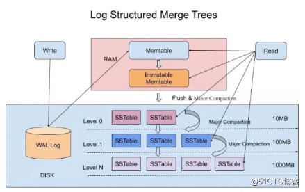
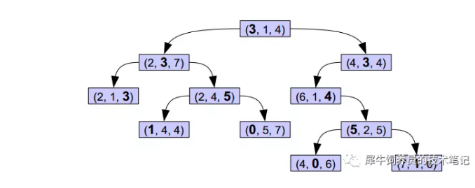

# Block k-d tree
## 背景
通过profile查看，发现耗时主要在status字段的build_scorer这个阶段。

对方同时提到，只要去掉`"status":["2", "4"]`这个查询条件，速度就会恢复正常。进一步询问后得知，查询的索引文档总量相当巨大，达到16亿条，而status字段只有几个不同的数字，在mapping里被定义为数值型short。

脑子里开始翻查ES 2.x -> 5.x升级对于数值类型和Term Query有何重大变化？想起来两点:

- Lucene6.0引入了重新设计的数值类型的索引结构，不再采用倒排索，而是使用了更适合范围查找的Block K-d Tree。 ES从5.0开始引入这种新结构。(参考: searching-numb3rs-in-5.0）
- Term Query由于通常非常快，从5.1.1开始不再被缓存到Query Cache

显然这个status字段不用于范围查找，字段类型设置上keyword比number更合理。 但我也没想明白为何number在这场景下查询会慢这么多，所以我也稍稍有些怀疑2.x缓存了Term Query是造成性能差异的原因。 当时让朋友做了个测试，将**TermQuery换成RangeQuery**，被告知速度飞快，只要几十个毫秒，并且多执行几次后更是快到只有几个毫秒了。(因为RangeQuery反复执行会被Cache起来)。

1. 为什么ES5.x里对数值型字段做TermQuery可能会很慢?
2. 为何Profile里显示的耗时几乎全部在build_scorer?
3. 为什么对同样的数值型字段做RangeQuery却又很快了？

为更好的理解这个问题，先谈一下几点预备知识:
1. ES2.x和5.x的数值类型分别是如何索引的
2. Block k-d tree的基本概念和Lucene实现
3. Queries/filters执行的先后顺序及结果合并是怎样做的

## 前言

### ES2.x和5.x的数值类型分别是如何索引的

ES5.x之前用到的Lucene版本，实际上**只能够索引文本类型的数据**，表面上被定义为数值类型的字段，在暗地里都被转换成了字符串，编排成了倒排索引。

这种结构对于精确的数值查询速度还是比较快的，直接从倒排索引根据查找的term拿到postings list就好了。 但类似`range: [50, 100]`这样的**范围查找**就比较麻烦了，Lucene在找到对应的term后，只能将其转换成类似`50 OR 51 OR 52 ... OR 100`这样的Bool查询。可想而知，这个多条件OR查询开销很高，执行很慢。所以Lucene在创建索引的时候，会**自动产生一些类似50x75 这样的特殊Term**，指向**包含在该范围的文档列表**，从而可以将查询优化成类似`50x75 OR 76x99 OR 100 `这种形式。但是这种优化在字段的不同值很多，**查询范围很大的时候，依然很无力**。 因此早期版本的Lucene和ES的范围查询性能一直被诟病。

Lucene从6.0开始引入了**Block k-d tree**来重新设计数值类型的索引结构，其目标是**让数值型数据索引的结构更紧凑，搜索速度更快**。这种数据结构是为**多维数值字段设计的，可以高效的用于诸如地理位置这类数据的快速过滤，但同样适用于单维度的数值型**。

### Block k-d tree的基本概念和Lucene实现

基本思想就是**将一个N维的数值空间，不断选定包含值最多的维度做2分切割，反复迭代，直到切分出来的空间单元(cell)包含的值数量小于某个数值**。 对于单维度的数据，实际上就是简单的对所有值做一个排序，然后反复从中间做切分，生成一个类似于B-tree这样的结构。和传统的B-tree不同的是，他的**叶子结点存储的不是单值，而是一组值的集合，也就是是所谓的一个Block**。每个Block内部包含的值数量控制在512- 1024个，保证**值的数量在block之间尽量均匀分布**。 其数据结构大致看起来是这样的:

> 叶子结点存储的不是单值，而是一组值的集合，也就是是所谓的一个Block（docId value）。 以value为序，key就是docid

Lucene将这颗B-tree的**非叶子结点部分放在内存里**，而**叶子结点紧紧相邻存放在磁盘上**。当作range查询的时候，内存里的B-tree可以**帮助快速定位到满足查询条件的叶子结点块在磁盘上的位置，之后对叶子结点块的读取几乎都是顺序的**。

要注意一点，不是简单的将拿到的所有块合并就可以得到想要的docID结果集，因为查询的上下边界不一定刚好落在两端block的上下边界上。 所以如果需要拿到range filter的结果集，就要对于两端的block内的docid做扫描，**将他们的值和range的上下边界做比较，挑选出match的docid集合**。

### Queries/filters执行的先后顺序及结果合并是怎样做的

ES的Queries/filters执行顺序比较复杂，**并非按照Query里条件的排列顺序来挨个执行**；**也不是**某些人想象的那样，**每个filter/Query都独立执行，拿到各自的结果集以后，再做结果集的合并**。 在[elasticsearch-query-execution-order](https://www.elastic.co/cn/blog/elasticsearch-query-execution-order) 这篇博客里对这个主题做了比较详细的介绍。

简单来说，ES会先通过调用**每个查询的cost()函数估算一下该查询的代价**，然后**选择代价最小的查询作为起点，在其圈定的docid集合上生成一个迭代器**。然后**反复迭代，根据和其他条件之间是AND还是OR的关系，再去决定结果集合并的方式**。

这个结果集的迭代，以及合并，就是上面链接里提到的**nextdoc()和advance()等**操作。 比较复杂的地方是这些操作根据**数据类型的不同和查询类型的不同，ES都有针对性的进行操作优化**，同样的操作有些可能是在**内存中进行**，有些则可能直接在**磁盘上进行**。

以最常见的keyword字段做TermQuery为例，其**cost就是Term Frequency**，这个值可以直接从倒排索引读取。 Frequency越高的Term，**其postings list就越长，迭代起来的代价就越高**。 所以如果对多个TermQuery做AND合并，就会**选择Frequency最低的Term**，以其postings list为起点做迭代(nextdoc)。

Postings list是**按照docid顺序存放的**，并且在数据结构上**还增加了跳表来加快advance()操作**。因此**多个postings list的合并可以直接操作磁盘上的数据而不会引起过多的随机IO**，加上ES5.0以后对于索引数据采取了**mmap file的方式访问，热数据读取引发的磁盘IO愈发的少**。

 这也是为什么5.1.1之后**取消了TermQuery的cache**，因为在**跳表和OS page cache的加持下，直接合并磁盘上的postings list已经非常快了**。 取消对其cache后，可以减少构造cache的开销，并且将宝贵的cache空间留给代价更高的filter，一定程度上可以提升ES整体性能。

> 跳表和OS page cache的加持下，直接合并磁盘上的postings list已经非常快了

_有了这些预备知识，再来解答文首抛出的3个问题_。
## 问题
### 1. 为什么ES5.x里对数值型字段做TermQuery可能会很慢?

首先，用户范例查询里还有**其他更加结果集更小的TermQuery**，cost更低，因此迭代器从选择从这个低代价的Query作为起点开始执行; 其次，因为**数值型字段在5.x里没有采用倒排表索引**， 而是**以value为序**，将docid切分到不同的block里面。

对应的，**数值型字段的TermQuery被转换为了PointRangeQuery**。这个Query利用**Block k-d tree进行范围查找速度非常快**，但是**满足查询条件的docid集合在磁盘上并非向Postlings list那样按照docid顺序存放，也就无法实现postings list上借助跳表做蛙跳的操作**。

要实现对docid集合的快速advance操作，**只能将docid集合拿出来，做一些再处理**。 这个处理过程在`org.apache.lucene.search.PointRangeQuery#createWeight`这个方法里可以读取到。 这里就不贴冗长的代码了，主要逻辑就是在**创建scorer对象的时候，顺带先将满足查询条件的docid都选出来，然后构造成一个代表docid集合的bitset**，这个过程和构造Query cache的过程非常类似。 **之后advance操作，就是在这个bitset上完成的**。

> 原因一： Block k-d tree 范围查询虽快，但是合并过程无法用到跳表进行快递advance操作

### 2. 为何Profile里显示的耗时几乎全部在build_scorer?
回答第一个问题的时候提到了，如果查看PointRangeQuery的源码，**构造scorer对象的构造过程包含了bitset的生成过程**，所以**耗时的实际上是构造一个巨大的bitset并在上面生成一个迭代器**。

### 3. 为什么对同样的数值型字段做RangeQuery却又很快了?

从上面数值型字段的Block k-d tree的特性可以看出，**rangeQuery的结果集比较小的时候，其构造bitset的代价很低**，不管是**从他开始迭代做nextdoc()**，或者**从其他结果集开始迭代，对其做advance，都会比较快**。 但是**如果rangeQuery的结果集非常巨大，则构造bitset的过程会大大延缓scorer对象的构造过程，造成结果合并过程缓慢**。

> nextdoc: 从自身开始迭代. advance: 从其他结果集开始迭代

> 原因二： rangeQuery的结果集非常巨大，则构造bitset的过程会大大延缓scorer对象的构造过程，造成结果合并过程缓慢

这个问题官方其实早已经意识到了，所以从**ES5.4**开始，引入了`indexOrDocValuesQuery`作为对RangeQuery的优化。（参考: [better-query-planning-for-range-queries-in-elasticsearch](https://www.elastic.co/blog/better-query-planning-for-range-queries-in-elasticsearch) ）。 这个Query包装了上面的`PointRangeQuery`和`SortedSetDocValuesRangeQuery`，并且**会根据Rang查询的数据集大小，以及要做的合并操作类型，决定用哪种Query**。

如果Range的**代价小**，可以用来**引领合并过程**，就走**PointRangeQuery，直接构造bitset来进行迭代**。 而如果range的**代价高，构造bitset太慢**，就**使用SortedSetDocValuesRangeQuery**。

这个Query利用了**DocValues这种全局docID序**，并**包含每个docid对应value的数据结构来做文档的匹配**。 当**给定一个docid的时候，一次随机磁盘访问就可以定位到该id对应的value，从而可以判断该doc是否match**。 因此它非常适合从**其他查询条件得到的一个小结果集作为迭代起点，对于每个docid依次调用其内部的matches()函数判断匹配与否**。

也就是说， 5.4新增的**indexOrDocValuesQuery将Range查询过程中的顺序访问任务扔给Block k-d Tree索引**，将**随机访任务交给doc values**。 值得注意的是**目前这个优化只针对RangeQuery**！对于TermQuery，因为实际的复杂性，还未做类似的优化，也就导致**对于数值型字段，Term和Range Query的性能差异极大**。

> 对于数值型字段，Term和Range Query的性能差异极大的原因: indexOrDocValuesQuery

> indexOrDocValuesQuery: 代价小，构造bitset。代价大，直接迭代匹配。其利用block k-d tree索引，一次随机磁盘访问定位到相应的docid的value(类btree的查找操作)

## 小结
在ES5.x里，**一定要注意数值类型是否需要做范围查询，看似数值，但其实只用于Term或者Terms这类精确匹配的，应该定义为keyword类型**。典型的例子就是索引web日志时常见的HTTP Status code。

如果**RangeQuery的结果集很大，并且还需要和其他结果集更小的查询条件做AND的，应该升级到ES5.4+，该版本在底层引入的indexOrDocValuesQuery，可以极大提升该场景下RangeQuery的查询速度**。

# 参考链接

- [number?keyword?傻傻分不清楚](https://elasticsearch.cn/article/446): wood大叔
- [ES查询性能优化-优先选择keyword类型](https://summerisgreen.com/blog/2019-12-01-2019-12-01-es%E6%9F%A5%E8%AF%A2%E6%80%A7%E8%83%BD%E4%BC%98%E5%8C%96-%E4%BC%98%E5%85%88%E9%80%89%E6%8B%A9keyword%E7%B1%BB%E5%9E%8B.html): 优先使用keyword而不是number!
- [Elasticsearch中keyword和numeric对性能的影响分析](https://my.oschina.net/u/4604498/blog/4915225) [原创|ES广告倒排索引架构演进与优化](https://juejin.cn/post/6844904009292054535)
- [searching-numb3rs-in-5.0](https://www.elastic.co/cn/blog/searching-numb3rs-in-5.0)

---
- [range过滤](https://bbs.huaweicloud.com/blogs/191274)

## LSM Tree

Elasticsearch，HBase, Cassandra, RockDB 等都是基于 LSM Tree 来构建索引。

LSM tree 是一种分层、有序、面向磁盘的数据结构，其核心思想是其充分的利用了**磁盘批量的顺序写要远比随机写性能高出很多的特点**。

LSM tree的核心特点：

第一：将索引分为内存和磁盘两部分，并在内存达到阈值时启动树合并（Merge Trees）；

第二：用批量写入代替随机写入，并且用预写日志 WAL 技术（Elasticsearch 中为 translog 事务日志）保证内存数据，在系统崩溃后可以被恢复；

第三：数据采取类似日志追加写的方式写入（Log Structured）磁盘，以顺序写的方式提高写入效率。

## 字符串类型text 的range原理

针对 LSM-Tree ，核心的数据结构就是 **SSTable** ，全称是 Sorted String Table ，SSTable 的概念其实也是来自于 Google 的 Bigtable 论文。

SSTable 是一种拥有**持久化，有序且不可变的的键值存储结构**，**它的 key 和 value 都是任意的字节数组，并且了提供了按指定key查找和指定范围的key区间迭代遍历的功能**。

SSTable 内部包含了一系列可配置大小的 Block 块，典型的大小是 64 KB，**关于这些Block块的索引存储在 SSTable 的尾部，用于帮助快速查找特定的 Block**。

查询的原理：当一个SSTable被打开的时候，索引会被加载到内存，然后**根据key在内存索引里面进行一个二分查找**，查到该 key 对应的磁盘的 offset 之后，然后去磁盘把响应的块数据读取出来。

range 的原理：在查询基础上，基于 SStable 文件（已有序）向后遍历找到直到找到大于右区间值停止遍历。

当然**如果内存足够大的话，可以直接把 SSTable 直接通过 MMap 的技术映射到内存中，从而提供更快的查找**。

> LSM-Tree的核心数据结构SSTable，一个有序的key-vaule的结构，以block块进行存储，并将block的索引存储在SSTable的尾部。以二分查找进行查找。

---
- [Elasticsearch中keyword和numeric对性能的影响分析](https://my.oschina.net/u/4604498/blog/4915225)

kd-tree（k-dimensional树的简称），是一种对**k维空间中的实例点进行存储以便对其进行快速检索的树形数据结构**。这种存储结构类似于mysql里的B+数，我们知道B+数这种数据结构**对于范围查找的支持是非常好的**。不同于mysql， Block KD tree的叶子节点**存储的是一组值的集合(block)**，大概是512~1024个值一组。这也是为什么叫block kd tree。

> 存储的是一组值的集合(block)

Block KD tree对于范围查询，邻近搜索支持的非常好，尤其是多维空间的情况下。

看上图，每个节点有三个元素，所以这里K=3，不同于简单二叉树每个节点都是一个元素（如下面这个图）。这样就可以方便的在一个三维的空间进行范围的比较。

---
# 参考链接
- [Elasticsearch 5.x 源码分析（12）对类似枚举数据的搜索异常慢的一种猜测](https://www.jianshu.com/p/9830413f62eb): 结合源码问题分析一例，可惜没结论
