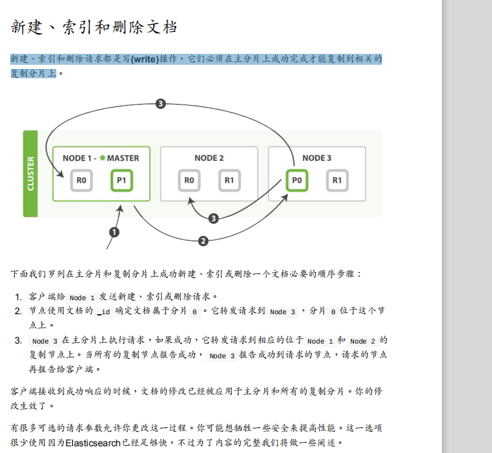

## cluster

cluster（集群）是一个或者多个节点的集合，它们一起保存数据并且提供所有节点联合索引以及搜索功能。集群存在一个唯一的名字身份且默认为 “elasticsearch”。这个名字非常重要，因为如果节点安装时通过它自己的名字加入到集群中的话，那么一个节点只能是一个集群中的一部分。

## node
node（节点）是一个**单独的服务器**，它是集群的一部分，存储数据，参与集群中的索引和搜索功能。像一个集群一样，一个节点通过一个在它启动时默认分配的一个随机的 UUID（通用唯一标识符）名称来识别。如果您不想使用默认名称您也可自定义任何节点名称。这个名字是要识别网络中的服务器对应这在您的 Elasticsearch 集群节点管理的目的是很重要的。

节点可以通过配置 **cluster name** 来加入到指定的集群中。默认情况下，每个节点安装时都会加入到名为 elasticsearch 的集群中，这也就意味着如果您在网络中启动许多节点--假设它们可以发现彼此–它们全部将自动的构成并且加入到一个名为 elasticsearch 的单独的集群中。

## Shards & Replicas（分片 & 副本）

索引可以存储大量数据，可以超过单个节点的硬件限制。例如，十亿个文档占用了 *1TB *的磁盘空间的单个索引可能不适合放在单个节点的磁盘上，并且从单个节点服务请求会变得很慢。

为了解决这个问题，Elasticsearch 提供了把 Index（索引）拆分到多个 Shard（分片）中的能力。在创建索引时，您可以简单的定义 Shard（分片）的数量。
Sharding（分片）非常重要两个理由是 :

- 水平的拆分/扩展。
- 分布式和**并行跨 Shard 操作**（可能在多个节点），从而提高了性能/吞吐量。
Shard 的分布式机制以及它的文档是如何聚合支持搜索请求是完全由 Elasticsearch 管理的，并且是对用户透明的

副本非常重要的两个理由是 :

- 在 shard/node 故障的情况下提供了高可用性。为了达到这个目的，需要注意的是在原始的/主 Shard 被复制时副本的 Shard **不会**被分配到**相同的节点上**。
- 它可以让你水平扩展搜索量/吞吐量，因为搜索可以在所有的副本上并行执行。

总而言之，每个索引可以被拆分成多个分片，一个索引可以设置 0 个（没有副本）或多个副本。开启副本后，每个索引将有主分片（被复制的原始分片）和副本分片（主分片的副本）。分片和副本的数量在索引被创建时都能够被指定。在创建索引后，您也可以在任何时候动态的改变副本的数量，但是不能够改变分片数量。

> 每个 Elasticsearch 分片是一个 **Lucene 索引**。在单个 Lucene 索引中有一个**最大的文档数量限制**

当然，在同样数量的节点上增加更多的复制分片并不能提高性能，因为这样做的话平均 每个分片的所占有的硬件资源就减少了（译者注：大部分请求都聚集到了分片少的节 点，导致一个节点吞吐量太大，反而降低性能），你需要增加硬件来提高吞吐量。

但是更多的副本分片数提高了数据冗余量：按照上面的节点配置，我们可以在失去2个节点的情况下不丢失任何数据。

> 所以有多少个分片就应该有多少个节点是最好的？这样子的话，可以看作单独一个节点享受所有的硬件资源。类似kafka的分区？

---
## 集群健康

集群的健康状况为 yellow 则表示全部 主 分片都正常运行（集群可以正常服务所有请求），但是 副本 分片没有全部处在正常状态。 实际上，所有3个副本分片都是 unassigned —— 它们都没有被分配到任何节点。 在同一个节点上既保存原始数据又保存副本是没有意义的，因为一旦失去了那个节点，我们也将丢失该节点上的所有副本数据。

我们关闭的节点是一个主节点。而集群必须拥有一个主节点来保证正常工作，所以发生的第一件事情就是选举一个新的主节点： Node 2 。

在我们关闭 Node 1 的同时也失去了主分片 1 和 2 ，并且在缺失主分片的时候索引也不能正常工作。 如果此时来检查集群的状况，我们看到的状态将会为 red ：不是所有主分片都在正常工作。

幸运的是，在其它节点上存在着这两个主分片的完整副本， 所以新的主节点立即将这些分片在 Node 2 和 Node 3 上对应的副本分片提升为主分片， 此时集群的状态将会为 yellow 。 这个**提升主分片的过程是瞬间发生的，如同按下一个开关一般**。

如果我们重新启动 Node 1 ，集群可以将缺失的副本分片再次进行分配，那么集群的状态也将如之前一样。如果 Node 1 依然**拥有着之前的分片**，它将尝试去**重用它们**，同时仅从主分片**复制发生了修改的数据文件**。

- https://www.elastic.co/guide/cn/elasticsearch/guide/current/_coping_with_failure.html

----

## 选择分片数
 了解存储需求之后，您可以研究索引策略。每个Elasticsearch索引都分成若干个分片。因为您不能轻易更改现有索引的主分片数量，所以在对第一个文档建立索引之前，应确定分片计数。
 
 选择许多分片的总体目标是在群集中的所有数据节点之间平均分配索引。但是，这些碎片不应太大或太多。一个好的经验法则是尝试将分片大小保持在**10-50 GiB**之间。大型分片可能会使Elasticsearch难以从**故障中恢复**，但是由于每个分片都使用**一定数量的CPU和内存**，因此拥有**过多的小分片**会导致性能问题和内存不足错误。换句话说，分片应足够小，以使基础的Amazon ES实例可以处理它们，

索引开销大概为数量的10%

 
 > （源数据+增长空间）*（1 +索引开销）/所需分片大小=主分片的大概数量

为什么主分片的数量只能在创建索引时定义且不能修改：**如果主分片的数量在未来改变了，所有先前的路由值就失效了，文档也就永远找不到了。**

一个分片并不是没有代价的。记住：

- 一个分片的底层即为一个 Lucene 索引，会消耗一定文件句柄、内存、以及 CPU 运转。
- 每一个搜索请求都需要命中索引中的每一个分片，如果每一个分片都处于不同的节点还好， 但如果多个分片都需要在同一个节点上竞争使用相同的资源就有些糟糕了。
- 用于计算相关度的词项统计信息是基于分片的。如果有许多分片，每一个都只有很少的数据会导致很低的相关度。

参考链接：

- https://www.elastic.co/guide/cn/elasticsearch/guide/current/shard-scale.html

---
## 结果震荡（Bouncing Results）、cache

preference：控制要对其执行搜索请求的**分片副本**的首选项。默认情况下，操作在分片副本之间是随机化的。

一个可能的用例是使用每个副本缓存，比如请求缓存。但是，这样做违背了搜索并行化的思想，并且会在某些节点上创建热点，因为负载可能**不再均匀分布**。
使用用户标识进行分配，这是一种有效的策略，可以增加对重复运行类似搜索的唯一用户的**请求缓存**的使用，方法是始终**命中同一个缓存**，而不同用户的请求仍然**分布**在所有碎片副本上。

默认情况下，请求缓存将仅缓存size为0的搜索请求的结果，因此它不会缓存hits，但将缓存hit.total、aggregations, and suggestions.

> 每个分片有各自的分片结果缓存，但是分片汇总后得到的汇总结果能在节点进行缓存？所以命中同一个节点，可以命中同样的缓存

> routing控制的是分片的路由搜索（可以得到过滤无关数据的目的）、preference控制的是分片副本的请求（达到重复搜索命中缓存、固定返回顺序的目的）。

仅限本地首选项(_only_local)保证仅在本地节点上使用碎片副本，这有时对故障排除很有用。所有其他选项都不能完全保证在搜索中使用任何特定的碎片副本，而在不断变化的索引上，这可能意味着，如果在处于不同刷新状态的不同碎片副本上执行重复搜索，则可能会产生不同的结果。

- https://www.elastic.co/guide/en/elasticsearch/reference/current/search-request-body.html#request-body-search-preference

> 也就是说preference能控制查询的分片副本固定，不然是随机的，以此来达到分片缓存和固定查询顺序。

想像一下，你正在按照 timestamp 字段来对你的结果排序，并且有两个document有相同 的timestamp。由于搜索请求是在所有有效的分片副本间轮询的，**这两个document可能 在原始分片里是一种顺序，在副本分片里是另一种顺序**。 
这就是被称为结果震荡（bouncing results）的问题：用户每次刷新页面，结果顺序会发 生变化。避免这个问题方法是对于同一个用户总是使用同一个分片。方法就是使用一个 随机字符串例如用户的会话ID（session ID）来设置 preference 参数。

- https://elasticsearch.cn/article/334

TODO: 评论： 请问，为什么副本的分片顺序是不一样的？如何大家都是保持顺序进行写入的话，不是顺序应该一样吗？那如果不是顺序的，是什么导致这个特性？ 

原因：基于文档的复制

当主分片转发更改给复制分片时，并不是转发更新请求，而是转发整个文档的新版本。记住这些修改转发到复制节点是异步的，它们并不能保证到达的顺序与发送相同。如果Elasticsearch转发的仅仅是修改请求，修改的顺序可能是错误的，那得到的就是个损坏的文档。

来源：https://es.xiaoleilu.com/040_Distributed_CRUD/25_Partial_updates.html

---
# 分布式增删改查

## 写操作

**新建、索引和删除请求都是写(write)操作，它们必须在主分片上成功完成才能复制到相关的复制分片上**

默认主分片在尝试写入时需要规定数量(quorum)或过半的分片（可以是主节点或复制节点）可用。这是防止数据被写入到错的网络分区。

### replication

复制默认的值是 sync 。这将导致主分片得到复制分片的成功响应后才返回。 

如果你设置 replication 为 async ，请求在主分片上被执行后就会返回给客户端。它依旧会 转发请求给复制节点，但你将不知道复制节点成功与否。 

上面的这个选项不建议使用。默认的 sync 复制允许Elasticsearch强制反馈传输。 async 复制 可能会因为在不等待其它分片就绪的情况下发送过多的请求而使Elasticsearch过载。

### consistency
consistency 允许的值为 one （只有一个主分片）， all （所有主分片和复制分片）或者默认的 quorum 或过半分片。类比kafka的ack。

## 检索文档

对于读请求，为了平衡负载，请求节点会为每个请求选择不同的分片——它会循环所有分片副本。

## 多文档模式
mget 和 bulk API与单独的文档类似。差别是请求节点知道每个文档所在的分片。它把多文档请求拆成每个分片的对文档请求，然后转发每个参与的节点。

一旦接收到每个节点的应答，然后整理这些响应组合为一个单独的响应，最后返回给客户端。

## 奇怪的格式

为什么 bulk API需要带换行符的奇怪格式，而不是像 mget API一样使用JSON数组？

但需要大量的RAM来承载本质上相同的数据，还要创建更多的数据结构使得JVM花更多的时间执行垃圾回收。

取而代之的，Elasticsearch则是从网络缓冲区中一行一行的直接读取数据。它使用换行符识别和解析action/metadata行，以决定哪些分片来处理这个请求。

---
## 分布式搜索

当一个搜索请求被发送到一个节点Node，这个节点就变成了协调节点。这个节点的工作是向**所有相关的分片广播搜索请求**并且把它们的响应整合成一个全局的有序结果集。这个结果集会被返回给客户端。

协调节点将这些分片级的结果合并到自己的有序优先队列里。这个就代表了最终的全局有序 结果集。到这里，查询阶段结束。 整个过程类似于归并排序算法，先分组排序再归并到一起，对于这种分布式场景非常适用

避免深分页的问题：每个分片必须构造一个长度为 from+size 的优先队列

---
## 版本控制

### 悲观并发控制（Pessimistic concurrency control）
这在关系型数据库中被广泛的使用，假设冲突的更改经常发生，为了解决冲突我们把访问区块化。典型的例子是在读一行数据前锁定这行，然后确保只有加锁的那个线程可以修改这行数据。

### 乐观并发控制（Optimistic concurrency control）：
被Elasticsearch使用，假设冲突不经常发生，也不区块化访问，然而，如果在读写过程中数据发生了变化，更新操作将失败。这时候由程序决定在失败后如何解决冲突。实际情况中，可以重新尝试更新，刷新数据（重新读取）或者直接反馈给用户。

当我们之前讨论 index ， GET 和 delete 请求时，我们指出每个文档都有一个 _version （版本）号，当文档被修改时版本号递增。 Elasticsearch 使用这个 _version 号来确保变更以正确顺序得到执行。如果旧版本的文档在新版本之后到达，它可以被简单的忽略。

- https://es.xiaoleilu.com/030_Data/40_Version_control.html

---
## scroll（滚屏）

一个滚屏搜索允许我们做一个初始阶段搜索并且**持续批量**从Elasticsearch里拉取结果直到没有结果剩下。这有点像传统数据库里的cursors（游标）。

滚屏搜索会**及时制作快照**。**这个快照不会包含任何在初始阶段搜索请求后对index做的修改**。 它通过将旧的数据文件保存在手边，所以可以保护index的样子看起来像搜索开始时的样子。

## scan（扫描）

深度分页代价最高的部分是对**结果的全局排序**，但如果**禁用排序**，就能以很低的代价获得全部返回结果。为达成这个目的，可以采用 scan（扫描） 搜索模式。扫描模式让Elasticsearch不排序，只要分片里还有结果可以返回，就返回一批结果。

 ?scroll=1m 。滚屏的终止时间会在我们每次执行滚屏请求时刷新，所以他只需要给我们足够的时间来处理当前批次的结果而不是所有的匹配查询的document。
 
这个过期时间的参数很重要，因为保持这个游标查询窗口需要消耗资源，所以我们期望如果不再需要维护这种资源就该早点儿释放掉。 设置这个超时能够让 Elasticsearch 在稍后空闲的时候自动释放这部分资源。

这个过期时间的参数很重要，因为保持这个游标查询窗口需要消耗资源，所以我们期望如果不再需要维护这种资源就该早点儿释放掉。 设置这个超时能够让 Elasticsearch 在稍后空闲的时候自动释放这部分资源。

- https://github.com/looly/elasticsearch-definitive-guide-cn/blob/master/060_Distributed_Search/20_Scan_and_scroll.md
- https://www.elastic.co/guide/cn/elasticsearch/guide/current/scroll.html
