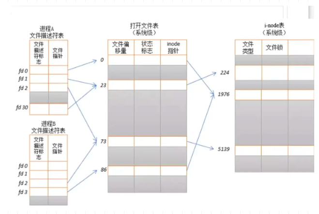
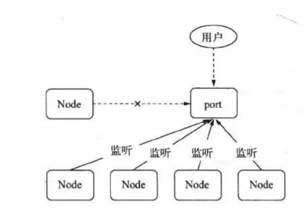

---
# node

Node 是个单进程**单线程模型**，他**线程安全**。

Node 进程只能有一个线程，那想通过单进程多线程的姿势来压榨 cpu（类似于 Java）应该是黄了，但 Node 支持**多进程模型**。

Node 提供了 child_process 模块，通过 child_process.fork()函数来进行进程的复制。

child_process 模块给予 Node 创建子进程的能力，父进程与子进程之间是一种 master/worker 的工作模式。

通常会阻塞的操作分发给 worker 来执行（查 db，读文件，进程耗时的计算等等），master 上尽量编写**非阻塞**的代码。

> 真的是单线程的吗？

## 通信

进程通信的姿势很多，例如基于 socket，基于管道，基于 mmap 内存映射

文件描述符是操作系统用来做文件管理的一个概念，如上图所示，**每个进程会有一个自己的文件描述符表**，里面包含了文件描述符标志和文件指针，每个进程自己的表都是从 0 开始，然后由**文件指针**来指向同一个系统级的打开文件表，打开文件表里面会记录文件偏移量（这个文件被读写到了哪个位置）、inode 指针。

再由 **inode 指针**来指向系统级的 inode 表，inode 表就是真正维护操作系统文件本身的一个实体了，里面包含了文件类型，大小，create time 等等～

其实系统中的文件描述符不一定是指向一个磁盘文件，也可以能是指向一个网络的 socket 这种，站在Linux的角度上来说，操作系统把一切都抽象为文件，网络数据，磁盘数据等等，都是用文件描述符来做维护。

### 多进程通信

在 fork 进程的时候父进程也会把自己的文件描述符拷贝给子进程

我们一开始调用 pipe(fd)，传人的是一个 size 是 2 的空数组，如果创建成功，这个数组的 fd[0]就是**读所用**的文件描述符，fd[1]就是**写所用**的文件描述符。

这个时候，我们在当前进程调用 vfork()，create 出一个子进程，父子进程都持有这个 fd[]。

如果我们判断是子进程，就关闭他的读文件描述符，如果是父进程，就关闭他的写文件描述符。

这时，如下图所示，我们会实现一个**单向通信**，操作系统调用 **pipe（创建管道**的时候，会**新建一片内存空间**，这片内存**专用与两个进程通信**，这应证了我们上面所说的，系统会把很多东西抽象成文件，比如这里就是把那一片共用内存抽象了起来，之后**子进程通过 fd[1]，往那片内存区域写入数据，父进程通过 fd[0]来读**，这里就实现了一个**单工通信**。
> nginx也是这样做的

但单向肯定是不行的，如何实现一个双工通信呢，很简单，用**两个管道**就 OK 了。
> 详情例子和代码可以看相关链接

**Node 自己抽象了一个 libuv 的概念，根据不同操作系统有不同的底层实现，我们上面讲到的双工管道通信就是其中一种。**

## Node 句柄传递 

master 监听默认的 80 端口，用户的请求都打在 80 上，其他子进程监听一个**别的端口**，当父进程收到后**往子进程监听的端口写数据**，子进程来做处理。

这里看似可以实现，实则浪费了太多文件描述符，上面讲到了每个进程都有文件描述符表，而每个 socket 的读写也是基于文件描述符，操作系统的**文件描述符是有限的**，这样的设计显然不够优雅，拓展性不强。

一开始依然是 master 进程监听 80，当收到用户请求之后，master 并不是直接把这些数据扔给 worker，而是在 80 端口接收到数据后，**生成对应的 socket**，再把该 socket 对应的**文件描述符**通过管道传给 worker，一个 socket 意味着服务端和客户端的一个数据通道，也就意味着 master 把跟客户端的数据通道传给了 worker。

> master监听，生成对应的socket，通过管道传递给worker。

如下图，在之后 master **停止监听 80port**，因为已经把文件描述符给了 worker，之后 worker 直接**监听这个套接字**即可。

于是就有了下面那种模式，**多个 worker 直接监听同一个 port**。

这个时候小伙伴们可能很疑惑，为啥这个时候不会端口冲突？？这里的关键在于两个点。

- 第一个是，Node 对每个端口监听设置了**SO_REUSEADRR**,标示可以允许这个端口被多个进程监听。

- 第二个点是，用这个的前提是每个监听这个端口的进程，**监听的文件描述符要相同**

之前讲文件描述符的时候提到过，文件描述符表是每个进程私有的，相互之间不可见，那对这个端口他们也会有各自的文件描述符，这样就无法利用 SO_REUSEADRR 的特性。

因为 master 在与 worker 通信的时候，每个子进程收到的文件描述符都是一样的（通过 master 传入，不理解的参见上面双工通信的讲解），这个时候就是所有子进程监听**相同**的 socket 文件描述符，就可以实现多个进程监听同一个端口的目标啦~。

> Node 利用 master/worker 模式来利用多核资源，利用 SO_REUSEADRR 与句柄（文件描述符）传递来使多个进程同时监听同一个端口，提高吞吐量。

Q: 请问master断开80端口的监听  那负载均衡谁做呢

A: 多个进程利用SO_REUSEPORT特性可以各自申请socket监听同一个端口，监听期间进程处于阻塞状态，当数据来时，内核做负载均衡，唤醒监听的其中一个进程处理。([惊群问题](../web/nginx/nginx.md#惊群问题))

> 将每个连接的socket都传到子进程中的，通过子进程监听抢占进行读写。所以会有惊群问题，nginx通过mutex互斥锁解决这个问题， epoll_wait()之前先去申请锁。负载均衡算法，负载7/8

- [多进程模型底层实现](https://juejin.im/post/5e7732aa518825492e497fe0)

