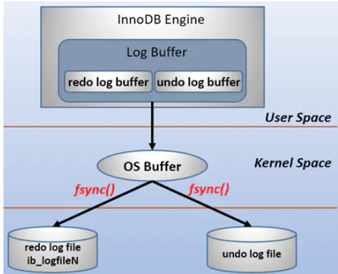
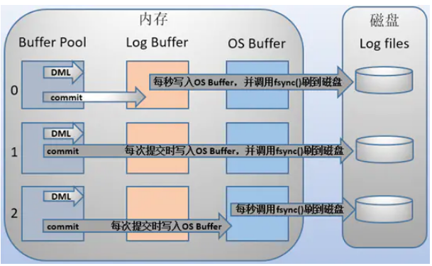
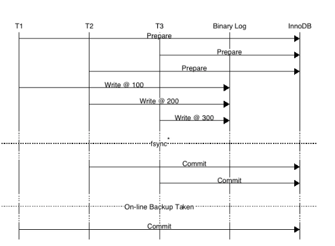
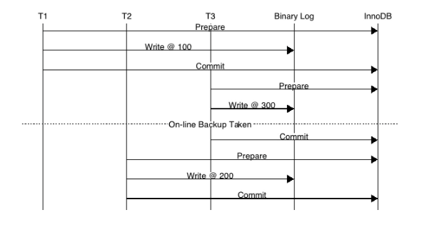

## redo log和undo log的区别
1. redo log通常是**物理日志，记录的是数据页的物理修改**，而不是某一行或某几行修改成怎样怎样，它用来**恢复提交后的物理数据页**(恢复数据页，且**只能恢复到最后一次提交的位置**)。
2. undo用来**回滚行记录到某个版本**。undo log一般是**逻辑日志，根据每行记录进行记录**。

## redo log和二进制日志的区别

1. 二进制日志是在存储引擎的上层产生的，**不管是什么存储引擎**，对数据库进行了修改**都会**产生二进制日志。而redo log是innodb层产生的，只记录该**存储引擎**中**表的修改**。并且二进制日志**先于**redo log被记录（group commit）。

2. 二进制日志记录操作的方法是**逻辑性**的语句。即便它是基于行格式的记录方式，其本质也还是逻辑的SQL设置，如该行记录的每列的值是多少。而redo log是在**物理格式**上的日志，它记录的是数据库中**每个页的修改**。

3. 二进制日志只在每次事务提交的时候**一次性**写入缓存中的日志"文件"。而redo log在数据**准备修改前**写入**缓存中的redo log**中，然后才对**缓存中的数据**执行**修改**操作；而且保证在发出事务**提交**指令时，**先向**缓存中的redo log**写入**日志，写入完成后才执行提交动作。

4. 因为二进制日志只在提交的时候一次性写入，所以二进制日志中的记录方式和提交**顺序有关**，且一次提交对应一次记录。而redo log中是**记录的物理页的修改**，redo log文件中同一个事务可能多次记录，最后一个提交的事务记录会**覆盖**所有未提交的事务记录。

5. 事务日志记录的是物理页的情况，它具有**幂等性**，因此记录日志的方式极其简练。幂等性的意思是多次操作前后状态是一样的，例如新插入一行后又删除该行，前后状态没有变化。而二进制日志记录的是所有影响数据的**操作**，记录的内容**较多**。例如插入一行记录一次，删除该行又记录一次。

> 二进制日志**先于**redo log被记录（group commit）

## redo log的基本概念

redo log包括两部分：一是**内存中的日志缓冲(redo log buffer)**，该部分日志是**易失性的**；二是磁盘上的**重做日志文件(redo log file)**，该部分日志是**持久的**。

在概念上，innodb通过`force log at commit`机制实现事务的持久性，即**在事务提交的时候，必须先将**该事务的所有事务日志写入到磁盘上的**redo log file**和**undo log file**中进行持久化。

中间还要经过操作系统内核空间的os buffer，调用fsync()的作用就是将OS buffer中的日志刷到磁盘上的log file中。

> **在事务提交的时候，必须先将**该事务的所有事务日志写入到磁盘上的**redo log file**和**undo log file**中进行持久化

> log buffer: 用户空间的内存缓存，容易丢失，重启就可能会丢。 os buffer: 内核态的文件缓存，与用户态无关。 log files: 同感fsync()刷盘到持久化磁盘中

### innodb_flush_log_at_trx_commit

MySQL支持用户自定义在commit时如何将**log buffer中的日志刷log file中**。这种控制通过变量 `innodb_flush_log_at_trx_commit` 的值来决定。该变量有3种值：0、1、2，默认为1。但注意，这个变量**只是控制commit动作是否刷新log buffer到磁盘**。

- 当设置为1的时候，事务**每次提交都会将log buffer中的日志写入os buffer并调用fsync()刷到log file on disk中**。这种方式**即使系统崩溃也不会丢失任何数据**，但是因为每次提交都写入磁盘，IO的性能较差。
- 当设置为0的时候，事务提交时不会将log buffer中日志写入到os buffer，而是**每秒写入os buffer并调用fsync()写入到log file on disk中**。也就是说设置为0时是(大约)每秒刷新写入到磁盘中的，当系统崩溃，会丢失1秒钟的数据。
- 当设置为2的时候，每次提交**都仅写入到os buffer**，然后是**每秒调用fsync()将os buffer中的日志**写入到log file on disk。

> 写入到os buffer，如果是数据库重启而不是机器重启，数据也不会丢失。

在**主从复制**结构中，要保证事务的持久性和一致性，需要对日志相关变量设置为如下：

- 如果启用了二进制日志，则设置`sync_binlog=1`，即每提交一次事务同步写到磁盘中。
- 总是设置`innodb_flush_log_at_trx_commit=1`，即每提交一次事务都写到磁盘中。

> 更好的插入数据的做法是将值设置为1，然后修改存储过程，将每次循环都提交修改为只提交一次。（也就是开启事务）

redo log file的大小对innodb的性能影响非常大，设置的太大，**恢复的时候就会时间较长**，设置的太小，就会导致在写redo log的时候循环切换redo log file。

> 0: 先写log buffer，每秒才刷到os buffer是最快的。但是因为log buffer到os buffer只是内存数据的转移，相比之下性能差距不大

## 日志刷盘的规则

log buffer中未刷到磁盘的日志称为**脏日志(dirty log)**。

刷日志到磁盘有以下几种规则：

1.发出commit动作时。已经说明过，commit发出后是否刷日志由变量 `innodb_flush_log_at_trx_commit` 控制。

2.每秒刷一次。这个刷日志的频率由变量 `innodb_flush_log_at_timeout 值决定`，默认是1秒。要注意，**这个刷日志频率和commit动作无关**。

3.当log buffer中**已经使用的内存超过一半时**。

4.当**有checkpoint时**，checkpoint在一定程度上代表了刷到磁盘时日志所处的LSN位置。

> `innodb_flush_log_at_trx_commit`的commit相关的控制规则只是刷盘规则其中之一。

> `innodb_flush_log_at_timeout`与commit动作无关，也就是不需要commit，redo log file也会刷盘。但是会根据undo log进行回滚。

## 数据页刷盘的规则及checkpoint

内存中(buffer pool)未刷到磁盘的数据称为脏数据(dirty data)。由于数据和日志都以页的形式存在，所以**脏页表示脏数据和脏日志**。

上一节介绍了日志是何时刷到磁盘的，不仅仅是日志需要刷盘，**脏数据页也一样需要刷盘**。

在innodb中，**数据刷盘的规则只有一个：checkpoint**。但是触发checkpoint的情况却有几种。不管怎样，checkpoint触发后，**会将buffer中脏数据页和脏日志页都刷到磁盘**。

由于刷脏页需要一定的时间来完成，所以记录检查点的位置是在每次刷盘结束之后才在redo log中标记的。

> 数据刷盘的规则只有一个：checkpoint。checkpoint会将buffer中脏数据页和脏日志页都刷到磁盘

## LSN超详细分析

LSN称为**日志的逻辑序列号**(log sequence number)

> LSN不仅存在于redo log中，还存在于数据页中，在每个数据页的头部，有一个fil_page_lsn记录了当前页最终的LSN值是多少。**通过数据页中的LSN值和redo log中的LSN值比较**，如果页中的LSN值小于redo log中LSN值，则表示数据丢失了一部分，这时候可以通过redo log的记录来恢复到redo log中记录的LSN值时的状态。

其中：

- log sequence number就是当前的redo log(in buffer)中的lsn；
- log flushed up to是刷到redo log file on disk中的lsn；
- pages flushed up to是已经刷到磁盘数据页上的LSN；
- last checkpoint at是上一次检查点所在位置的LSN。

注意点：

数据页不可能永远只停留在内存中，在某些情况下，会触发checkpoint来将内存中的脏页(数据脏页和日志脏页)刷到磁盘，所以会在本次checkpoint脏页刷盘结束时，在redo log中记录checkpoint的LSN位置，暂且称之为checkpoint_lsn。

要记录checkpoint所在位置很快，只需简单的设置一个标志即可，但是**刷数据页并不一定很快**，例如这一次checkpoint要刷入的数据页非常多。也就是说要刷入所有的数据页需要一定的时间来完成，中途刷入的每个数据页都会记下当前页所在的LSN，暂且称之为data_page_on_disk_lsn。

详情见参考链接

- 开启了一个事务，并立刻执行了一个update操作，更新log sequence number
- 之后又执行了一个delete语句，LSN增长到150。
- 一秒后触发redo log刷盘的规则，时redo log file on disk中的LSN会更新到和redo log in buffer的LSN一样，所以都等于150
- 随后检查点出现，会触发数据页和日志页刷盘。进行**数据刷盘**。得到一致的点。
- 随后执行了提交动作，即位置⑧。默认情况下，提交动作会触发日志刷盘，但不会触发数据刷盘。
- 最后随着时间的推移，检查点再次出现，即图中位置⑨。但是这次检查点不会触发日志刷盘，因为日志的LSN在检查点出现之前已经同步了。假设这次数据刷盘速度极快，快到一瞬间内完成而无法捕捉到状态的变化
- 这时 show engine innodb status 的结果将是各种LSN相等。

## innodb的恢复行为

因为redo log记录的是数据页的物理变化，因此恢复的时候速度比逻辑日志(如二进制日志)要快很多。而且，innodb自身也做了一定程度的优化，让恢复速度变得更快。

重启innodb时，**checkpoint表示已经完整刷到磁盘上data page上的LSN**，因此恢复时仅需要恢复从checkpoint开始的日志部分。例如，当数据库在上一次checkpoint的LSN为10000时宕机，且事务是已经提交过的状态。启动数据库时会检查磁盘中数据页的LSN，如果数据页的LSN小于日志中的LSN，则**会从检查点开始恢复**。

另外，事务日志具有幂等性，所以多次操作得到同一结果的行为在日志中只记录一次。而二进制日志不具有幂等性，多次操作会全部记录下来，在恢复的时候会多次执行二进制日志中的记录，速度就慢得多。

> 个人理解：redo log 是为了持久**更改**数据页的操作。但是内存的数据页的还是在内存里面，并没有进行数据落地，是通过[日志刷盘的规则](#日志刷盘的规则)~~checkpoint机制~~进行刷盘。然后在数据刷盘的时候，即使checkpoint挂了，也可以通过redo log进行恢复。 checkpoint表示已经完整刷到磁盘上data page上的LSN。

> 所以前提是redo log和undo log先于commit进行持久化。commit后，即使数据日志在checkpoint过程中挂了，也可以通过数据页中记录的LSN与日志页中的LSN进行对比，从检查点进行恢复。

# undo log

undo log有两个作用：**提供回滚和多个行版本控制(MVCC)**。

在数据修改的时候，不仅记录了redo，还记录了相对应的undo，如果因为某些原因导致事务失败或回滚了，可以借助该undo进行回滚。

undo log和redo log记录物理日志不一样，它是**逻辑日志**。可以认为当delete一条记录时，undo log中会记录一条对应的insert记录，反之亦然，当update一条记录时，它记录一条对应相反的update记录。

当执行rollback时，就可以**从undo log中的逻辑记录读取到相应的内容并进行回滚**。有时候应用到行版本控制的时候，也是通过undo log来实现的：当读取的某一行被其他事务锁定时，它可以**从undo log中分析出该行记录以前的数据是什么**，从而提供该行版本信息，让用户实现**非锁定一致性读取**。

undo log是采用段(segment)的方式来记录的，每个undo操作在记录的时候占用一个undo log segment。

另外，**undo log也会产生redo log，因为undo log也要实现持久性保护**。

### delete/update操作的内部机制

但是在事务提交的时候，会将该事务对应的**undo log放入到删除列表中**，未来通过purge来删除。并且提交事务时，还**会判断undo log分配的页是否可以重用**，如果可以重用，则会**分配给后面来的事务**，避免为每个独立的事务分配独立的undo log页而浪费**存储空间和性能**。

----

# binlog和事务日志的先后顺序及group commit

如果事务不是只读事务，即涉及到了数据的修改，默认情况下会在commit的时候调用fsync()将日志刷到磁盘，保证事务的持久性。

但是一次刷一个事务的日志性能较低，特别是事务集中在某一时刻时事务量非常大的时候。innodb提供了group commit功能，可以将多个事务的事务日志通过一次fsync()刷到磁盘中。

在MySQL5.6以前，当事务提交(即发出commit指令)后，MySQL接收到该信号进入commit prepare阶段；
- 进入prepare阶段后，立即写内存中的二进制日志，写完内存中的二进制日志后**就相当于确定了commit操作**；
- 然后开始写内存中的事务日志；
- 最后将二进制日志和事务日志刷盘，它们如何刷盘，分别由变量 sync_binlog 和  innodb_flush_log_at_trx_commit 控制。

疑问：二进制内存中就能确认commit？应该是不对的。书中所写保持一致性是用了二阶段事务。

---
# 上面的一些补充

## 两阶段提交

server -> binary log
- 写入二进制write return ok
- fsync return ok
> 这里是有fsync操作的，才能保证commit。

server -> Engine
- commit(事务日志) return ok
这时候server才返回ok给session。

两阶段提交不是 Redo Log 或 InnoDB 中的设计，而是 MySQL 服务器的设计（但通常说到两阶段提交时都和 Redo Log 放在一起）。因为 MySQL 采用插件化的存储引擎设计，事务提交时，服务器本身和存储引擎都需要提交数据。所以从 MySQL 服务器角度看，其本身就面临着**分布式事务**问题。

为解决此问题，MySQL 引入了**两阶段提交**。在两阶段提交过程中，Redo Log 会有两次操作：Prepare 和 Commit。而 Binlog 写操作则夹在 Redo Log 的 Prepare 和 Commit 操作**之间**。我们可以设想一下不同**失败场景**下两阶段提交的设计是如何保证数据一致的：

1.Redo Log Prepare 成功，在写 Binlog 前崩溃：在故障恢复后事务就会**回滚**。这样 Redo Log 和 Binlog 的内容还是一致的。这种情况比较简单，比较复杂的是下一种情况，即在写 Binlog 和 Redo Log Commit 中间崩溃时，MySQL 是如何处理的？

2.在写 Binlog 之后，但 Redo Log 还没有 Commit 之前崩溃

- 如果 Redo Log 有 Commit 标识，说明 Redo Log 其实已经 Commit 成功。这时直接提交事务；
- 如果 Redo Log 没有 Commit 标识，则使用 **XID（事务 ID）查询 Binlog 相应日志**，并检查日志的**完整**。如果 Binlog 是**完整**的，则**提交事务**，否则回滚；

如何判断 Binlog 是否完整？简单来说 Statement 格式的 Binlog 最后有 **Commit**，或 Row 格式的 **Binlog 有 XID Event**，那 Binlog 就是完整的。

> 所以上面说的是二进制刷盘后（而不是内存）就能说是commit了。

- [MySQL Binlog 技术原理和业务应用案例分析](https://www.infoq.cn/article/WgpHMOZxCLBNQYlSksW3)

----
# 2PC

为了性能考虑，每次提交事务的时候，只需要将redo和undo落盘就代表事务已经持久化了，而不需要等待数据落盘。这样就已经能保证事务的crash时的前滚或者回滚。由于undo的信息也会写入redo，所以其实我们只需要根据redo是否落盘而决定crash recovrey的时候是重做还是回滚。而上面提到，开启binlog后，还需要考虑binlog是否落盘（binlog牵扯到主从数据一致性，全备恢复的位点）。**根据事务是否成功写binlog(XID)决定事务的重做还是回滚。**

2PC即innodb对于事务的两阶段提交机制。当mysql开启binlog的时候，会存在一个内部XA的问题：事务在存储引擎层（redo）commit的顺序和在binlog中提交的顺序不一致的问题。

## 原理

prepare阶段：redo持久化到磁盘（redo group commit），并将**回滚段**置为**prepared状态**，此时binlog**不做**操作。

commit阶段：**innodb释放锁，释放回滚段**，设置提交状态，binlog持久化到磁盘，然后存储引擎层提交

## Crash Recovery

### Crash Recovery(no binlog)
由于未提交的事务和已回滚的事务也会记录到redo log中，因此在进行恢复的时候，这些事务要进行特殊的处理

innodb的处理策略是：进行恢复时，从checkpoint开始，重做所有事务（包括**未提交的事务**和已回滚的事务），然后通过undo log回滚那些未提交的事务

### XA Crash Recovery

1、扫描最后一个 binlog，提取xid（标识binlog中的第几个event）

2、xid也会写到redo中，将redo中prepare状态的xid，去跟最后一个binlog中的xid比较 ，如果binlog中存在，则提交，否则回滚

为什么只扫描最后一个binlog？因为binlog rotate的时候会把前面的binlog都刷盘，而且事务是不会跨binlog的

> 总结： **prepare阶段，redo的预处理，锁定资源类似的操作。回滚段的设置。然后bin log 持久化和redo log 的持久化。恢复操作：对比bin log 和 redo log 的最后xid， 如果相等，证明完整。如果bin log 的commit 了，redo log 没有完成，则根据bin log 完成提交。如果bin log和redo log 都没有提交，则根据undo log 进行回滚。**

----

# group commit

group commit的出现就是**为了将日志（redo/binlog）刷盘的动作合并，从而提升IO性能**

事务按照T1、T2、T3顺序开始执行，将二进制日志（按照T1、T2、T3顺序）写入日志文件系统缓冲，调用fsync()进行一次group commit将日志文件永久写入磁盘，但是存储引擎提交的顺序为T2、T3、T1。当T2、T3提交事务之后，若通过在线物理备份进行数据库恢复来建立复制时，因为在InnoDB存储引擎层会检测事务T3**在上下两层都完成了事务提交**，不需要在进行恢复了，此时主备数据不一致

因为要保证二进制日志和事务日志的一致性，MySQL 5.6版本之前，在提交后的prepare阶段会**启用一个prepare_commit_mutex锁来保证它们的顺序性和一致性**。但这样会导致开启二进制日志后**group commmit失效**，特别是在主从复制结构中，几乎都会开启二进制日志。

## Redo Group Commit

这个过程是根据LSN的顺序进行合并的，也就是说一次redo group commit的过程可能会**将别的未提交事务中的lsn也一并刷盘**

## Binlog Group Commit

> Binlog Group Commit的基本思想是引入队列机制，保证innodb commit的顺序与binlog落盘的顺序一致，并将事务分组，组内的binlog刷盘动作交给一个事务进行，实现组提交目的。队列中的第一个事务称为leader，其他事务称为follower。所有事情交给leader去做。

提交事务时，在存储引擎层的上一层结构中会将事务按序放入一个队列，**队列中的第一个事务称为leader，其他事务称为follower**，leader控制着follower的行为。虽然顺序还是一样先刷二进制，再刷事务日志，但是机制完全改变了：**删除了原来的prepare_commit_mutex行为，也能保证即使开启了二进制日志，group commit也是有效的**。

- flush阶段：向内存中写入每个事务的二进制日志。
- sync阶段：将内存中的二进制日志刷盘。**若队列中有多个事务，那么仅一次fsync操作就完成了二进制日志的刷盘操作**。这在MySQL5.6中称为**BLGC(binary log group commit)**。
- commit阶段：leader根据顺序调用**存储引擎层**事务的提交，由于innodb本就支持group commit，所以解决了因为锁 prepare_commit_mutex 而导致的group commit失效问题。

在flush阶段写入二进制日志到内存中，但是不是写完就进入sync阶段的，而是要等待一定的时间，多积累几个事务的binlog一起进入sync阶段，**等待时间由变量 `binlog_max_flush_queue_time` 决定，默认值为0表示不等待直接进入sync**，设置该变量为一个大于0的值的好处是group中的事务多了，性能会好一些，但是这样会导致事务的响应时间变慢，所以**建议不要修改该变量的值，除非事务量非常多并且不断的在写入和更新**。

进入到sync阶段，会将binlog从内存中刷入到磁盘，刷入的数量和单独的二进制日志刷盘一样，由变量 `sync_binlog` 控制。

当有一组事务在进行commit阶段时，**其他新事务可以进行flush阶段，它们本就不会相互阻塞**，所以group commit会不断生效。当然，group commit的性能和队列中的**事务数量有关**，如果每次队列中只有1个事务，那么group commit和单独的commit没什么区别，当队列中事务越来越多时，即提交事务越多越快时，group commit的效果越明显。

由于有多个队列，**每个队列各自有mutex保护，队列之间是顺序的**，约定进入队列的一个线程为leader，因此FLUSH阶段的leader可能是SYNC阶段的follower，但是follower永远是follower。

> 个人理解。通过队列进行解耦，并且通过先进先出控制顺序。得到并行保持顺序性。

---

参考链接：
- [详细分析MySQL事务日志](https://juejin.im/entry/5ba0a254e51d450e735e4a1f)
- [MySQL Redo/Binlog Group Commit , 2pc事务两阶段提交，Crash Recovery浅析](https://segmentfault.com/a/1190000014810628)

---
原文的一些讨论也是挺精彩的。

Q: redo log 刷盘，那这部分未提交事务的 log record 也会保存到 redo log file 中，如果在这个时候MySQL服务宕机，重启MySQL时，怎么判断 redo log file 中的 log record 所属的事务是否已经提交呢？

A: 这个很容易判断的。每个事务都有事务ID，对应这个事务ID，提交后都有提交标记。重启服务后检查redo log的时候，发现这个事务没有对应的标记，那么就是未完成事务

- [详细分析MySQL事务日志(redo log和undo log)](https://www.cnblogs.com/f-ck-need-u/p/9010872.html)
