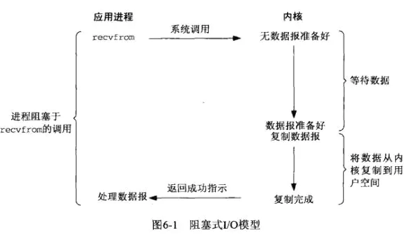
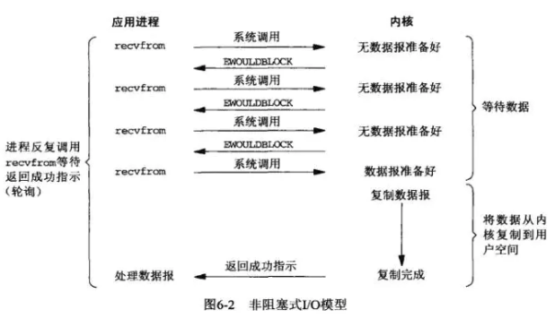
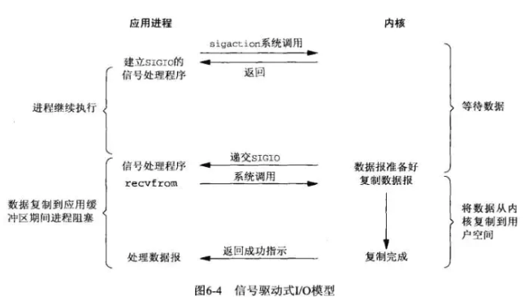
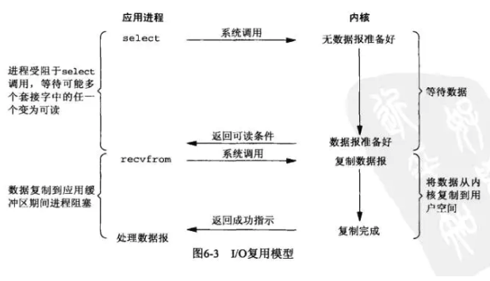
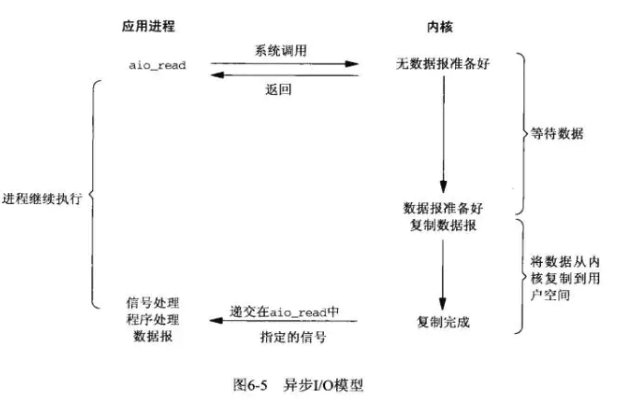
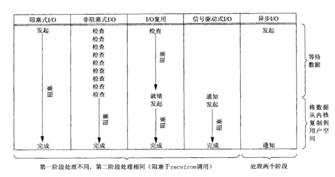

## 阻塞IO模型
应用进程通过系统调用 recvfrom 接收数据，但由于内核还未准备好数据报，应用进程就会阻塞住，直到内核准备好数据报，recvfrom 完成数据报复制工作，应用进程才能结束阻塞状态。

## 非阻塞IO模型
映射到Linux操作系统中，这就是非阻塞的IO模型。应用进程与内核交互，目的未达到之前，不再一味的等着，而是直接返回。然后通过轮询的方式，不停的去问内核数据准备有没有准备好。如果某一次轮询发现数据已经准备好了，那就把数据拷贝到用户空间中。

## 信号驱动IO模型
映射到Linux操作系统中，这就是信号驱动IO。应用进程在读取文件时通知内核，如果某个 socket 的某个事件发生时，请向我发一个信号。在收到信号后，信号对应的处理函数会进行后续处理。

应用进程预先向内核注册一个信号处理函数，然后用户进程返回，并且不阻塞，当内核数据准备就绪时会发送一个信号给进程，用户进程便在信号处理函数中开始把数据拷贝的用户空间中。

## IO复用模型
映射到Linux操作系统中，这就是IO复用模型。多个进程的IO可以注册到同一个管道上，这个管道会统一和内核进行交互。当管道中的某一个请求需要的数据准备好之后，进程再把对应的数据拷贝到用户空间中。

IO多路转接是多了一个select函数，多个进程的IO可以注册到同一个select上，当用户进程调用该select，select会监听所有注册好的IO，如果所有被监听的IO需要的数据都没有准备好时，select调用进程会阻塞。当任意一个IO所需的数据准备好之后，select调用就会返回，然后进程在通过recvfrom来进行数据拷贝。

这里的IO复用模型，并没有向内核注册信号处理函数，所以，他并不是非阻塞的。进程在发出select后，要等到select监听的所有IO操作中至少有一个需要的数据准备好，才会有返回，并且也需要再次发送请求去进行文件的拷贝。

> 多路复用这个图和blocking IO的图其实并没有太大的不同，事实上，还更差一些。因为这里需要使用两个system call (select 和 recvfrom)，而blocking IO只调用了一个system call (recvfrom)。但是，用select的优势在于它可以同时处理多个connection。

> 以上四种都是同步的。原因是因为，无论以上那种模型，**真正的数据拷贝过程**，都是同步进行的。

## 异步IO模型
映射到Linux操作系统中，这就是异步IO模型。应用进程把IO请求传给内核后，完全由内核去操作文件拷贝。内核完成相关操作后，会发信号告诉应用进程本次IO已经完成。

用户进程发起aio_read操作之后，给内核传递描述符、缓冲区指针、缓冲区大小等，告诉内核当整个操作完成时，如何通知进程，然后就立刻去做其他事情了。当内核收到aio_read后，会立刻返回，然后内核开始等待数据准备，数据准备好以后，直接把数据拷贝到用户控件，然后再通知进程本次IO已经完成。

> linux下的asynchronous IO其实用得很少

## 5种IO模型对比

---
## 参考链接：
- [Linux的五种IO模型](https://juejin.im/post/5b94e93b5188255c672e901e#heading-7)
- [Linux IO模式及 select、poll、epoll详解](https://segmentfault.com/a/1190000003063859)

> 理解： IO一般是同步的，真正的异步IO很少使用。同步IO实现异步需要针对哪一个通信层次，例如异步框架的实现。[参考: epoll与异步](epoll.md)
>> **io分两个阶段，1.询问内核准备好数据没有 2.从内核读数据。阻塞，非阻塞都是指阶段一。同步异步指阶段2。** 