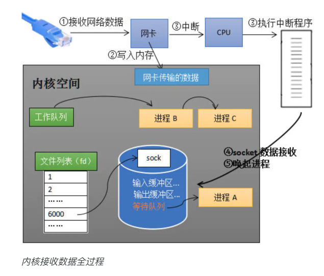
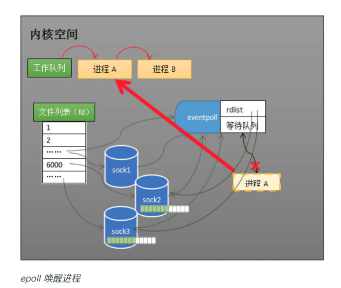

## 网卡接收数据
从网卡接收数据的流程讲起，串联起 CPU 中断、操作系统进程调度等知识；再一步步分析阻塞接收数据、select 到 epoll 的进化过程；最后探究 epoll 的实现细节。

网卡会把接收到的数据写入内存。通过硬件传输，网卡接收的数据存放到内存中，操作系统就可以去读取它们。

## 如何知道接收了数据
计算机执行程序时，会有优先级的需求。比如，当计算机收到断电信号时，它应立即去保存数据，保存数据的程序具有较高的优先级

由硬件产生的信号需要 CPU 立马做出回应，不然数据可能就丢失了，所以它的优先级很高。CPU 理应中断掉正在执行的程序，去做出响应；当 CPU 完成对硬件的响应后，再重新执行用户程序。中断的过程如下图，它和函数调用差不多，只不过函数调用是事先定好位置，而中断的位置由“信号”决定。

以键盘为例，当用户按下键盘某个按键时，键盘会给 CPU 的中断引脚发出一个高电平，CPU 能够捕获这个信号，然后执行键盘中断程序。下图展示了各种硬件通过中断与 CPU 交互的过程。

现在可以回答“如何知道接收了数据？”这个问题了：当网卡把数据写入到内存后，网卡向 CPU 发出一个中断信号，操作系统便能得知有新数据到来，再通过网卡中断程序去处理数据。

## 进程阻塞为什么不占用 CPU 资源

阻塞是进程调度的关键一环，指的是进程在等待某事件（如接收到网络数据）发生之前的等待状态，recv、select 和 epoll 都是阻塞方法。

下边分析一下进程阻塞为什么不占用 CPU 资源？

操作系统为了支持多任务，实现了进程调度的功能，会把进程分为“运行”和“等待”等几种状态。运行状态是进程获得 CPU 使用权，正在执行代码的状态；等待状态是阻塞状态，比如上述程序运行到 recv 时，程序会从运行状态变为等待状态，接收到数据后又变回运行状态。操作系统会分时执行各个运行状态的进程，由于速度很快，看上去就像是同时执行多个任务。

当进程 A 执行到创建 socket 的语句时，操作系统会创建一个由文件系统管理的 socket 对象（如下图）。这个 socket 对象包含了发送缓冲区、接收缓冲区与等待队列等成员。等待队列是个非常重要的结构，它指向所有需要等待该 socket 事件的进程。

当程序执行到 recv 时，操作系统会将进程 A 从工作队列移动到该 socket 的等待队列中（如下图）。由于工作队列只剩下了进程 B 和 C，依据进程调度，CPU 会轮流执行这两个进程的程序，不会执行进程 A 的程序。所以进程 A 被阻塞，不会往下执行代码，也不会占用 CPU 资源。

当 socket 接收到数据后，操作系统将该 socket 等待队列上的进程重新放回到工作队列，该进程变成运行状态，继续执行代码。同时由于 socket 的接收缓冲区已经有了数据，recv 可以返回接收到的数据。

## 内核接收网络数据全过程

唤醒进程
以上是内核接收数据全过程，这里我们可能会思考两个问题：

- 其一，操作系统如何知道网络数据对应于哪个 socket？
- 其二，如何同时监视多个 socket 的数据？

第一个问题：因为一个 socket 对应着一个端口号，而网络数据包中包含了 ip 和端口的信息，内核可以通过端口号找到对应的 socket。当然，为了提高处理速度，操作系统会维护端口号到 socket 的索引结构，以快速读取。

第二个问题是多路复用的重中之重，也正是本文后半部分的重点。

----

## 同时监视多个 socket 的简单方法

### select
服务端需要管理多个客户端连接，而 recv 只能监视单个 socket，这种矛盾下，人们开始寻找监视多个 socket 的方法。epoll 的要义就是高效地监视多个 socket。

假如能够预先传入一个 socket 列表，如果列表中的 socket 都没有数据，挂起进程，直到有一个 socket 收到数据，唤醒进程。这种方法很直接，也是 select 的设计思想。

为方便理解，我们先复习 select 的用法。在下边的代码中，先准备一个数组 fds，让 fds 存放着所有需要监视的 socket。然后调用 select，如果 fds 中的所有 socket 都没有数据，select 会阻塞，直到有一个 socket 接收到数据，select 返回，唤醒进程。用户可以遍历 fds，通过 FD_ISSET 判断具体哪个 socket 收到数据，然后做出处理。

但是简单的方法往往有缺点，主要是：

- 其一，每次调用 select 都需要将进程加入到所有监视 socket 的等待队列，每次唤醒都需要从每个队列中移除。这里涉及了两次遍历，而且每次都要将整个 fds 列表传递给内核，有一定的开销。正是因为遍历操作开销大，出于效率的考量，才会规定 select 的最大监视数量，默认只能监视 1024 个 socket。

- 其二，进程被唤醒后，程序并不知道哪些 socket 收到数据，还需要遍历一次。

## epoll 的设计思路

### 功能分离
select 低效的原因之一是将“维护等待队列”和“阻塞进程”两个步骤合二为一。如下图所示，每次调用 select 都需要这两步操作，然而大多数应用场景中，需要监视的 socket 相对固定，并不需要每次都修改。epoll 将这两个操作分开，先用 epoll_ctl 维护等待队列，再调用 epoll_wait 阻塞进程。显而易见地，效率就能得到提升。

### 就绪列表
select 低效的另一个原因在于程序不知道哪些 socket 收到数据，只能一个个遍历。如果内核维护一个“就绪列表”，引用收到数据的 socket，就能避免遍历。如下图所示，计算机共有三个 socket，收到数据的 sock2 和 sock3 被就绪列表 rdlist 所引用。当进程被唤醒后，只要获取 rdlist 的内容，就能够知道哪些 socket 收到数据。

## epoll 的原理与工作流程

如下图所示，当某个进程调用 epoll_create 方法时，内核会创建一个 eventpoll 对象（也就是程序中 epfd 所代表的对象）。eventpoll 对象也是文件系统中的一员，和 socket 一样，它也会有等待队列。

创建 epoll 对象后，可以用 epoll_ctl 添加或删除所要监听的 socket。以添加 socket 为例，如下图，如果通过 epoll_ctl 添加 sock1、sock2 和 sock3 的监视，内核会将 eventpoll 添加到这三个 socket 的等待队列中。

当 socket 收到数据后，中断程序会给 eventpoll 的“就绪列表”添加 socket 引用。如下图展示的是 sock2 和 sock3 收到数据后，中断程序让 rdlist 引用这两个 socket。

eventpoll 对象相当于 socket 和进程之间的中介，socket 的数据接收并不直接影响进程，而是通过改变 eventpoll 的就绪列表来改变进程状态。
当程序执行到 epoll_wait 时，如果 rdlist 已经引用了 socket，那么 epoll_wait 直接返回，如果 rdlist 为空，阻塞进程。

当 socket 接收到数据，中断程序一方面修改 rdlist，另一方面唤醒 eventpoll 等待队列中的进程，进程 A 再次进入运行状态（如下图）。也因为 rdlist 的存在，进程 A 可以知道哪些 socket 发生了变化。

---

## 实现细节

### 就绪列表的数据结构

就绪列表引用着就绪的 socket，所以它应能够快速的插入数据。
程序可能随时调用 epoll_ctl 添加监视 socket，也可能随时删除。当删除时，若该 socket 已经存放在就绪列表中，它也应该被移除。所以就绪列表应是一种能够快速插入和删除的数据结构。
双向链表就是这样一种数据结构，epoll 使用双向链表来实现就绪队列（对应上图的 rdllist）。

### 索引结构

既然 epoll 将“维护监视队列”和“进程阻塞”分离，也意味着需要有个数据结构来保存监视的 socket，至少要方便地添加和移除，还要便于搜索，以避免重复添加。红黑树是一种自平衡二叉查找树，搜索、插入和删除时间复杂度都是O(log(N))，效率较好，epoll 使用了红黑树作为索引结构（对应上图的 rbr）。
注：因为操作系统要兼顾多种功能，以及由更多需要保存的数据，rdlist 并非直接引用 socket，而是通过 epitem 间接引用，红黑树的节点也是 epitem 对象。同样，文件系统也并非直接引用着 socket。为方便理解，本文中省略了一些间接结构。

> select每次都需要遍历列表添加等待队列（用户复制到内核），唤醒需要进行删除。而且需要遍历获知哪个fd就绪。而epoll则通过eventpoll对象进行管理，epoll_ctl添加到socket的等待队列中，而且唤醒时，添加到eventpoll的队列中，避免再次遍历。

- [从硬件入手深入理解epoll 的本质](https://my.oschina.net/editorial-story/blog/3052308?p=3)
- [node异步非阻塞](../js/IO与事件循环.md)

---
# epoll

epoll使用一个文件描述符管理多个描述符，将用户关系的文件描述符的事件存放到内核的一个事件表中，这样在用户空间和内核空间的copy只需一次。

## 基本原理

epoll支持水平触发和边缘触发，最大的特点在于边缘触发，它只告诉进程哪些fd刚刚变为就绪态，并且只会通知一次。还有一个特点是，epoll使用“事件”的就绪通知方式，通过epoll_ctl注册fd，一旦该fd就绪，内核就会采用类似callback的回调机制来激活该fd，epoll_wait便可以收到通知。

## epoll的优点：

- 没有最大并发连接的限制，能打开的FD的上限远大于1024（1G的内存上能监听约10万个端口）。

- 效率提升，不是轮询的方式，不会随着FD数目的增加效率下降。只有活跃可用的FD才会调用callback函数；即Epoll最大的优点就在于它只管你“活跃”的连接，而跟连接总数无关，因此在实际的网络环境中，Epoll的效率就会远远高于select和poll。

- 内存拷贝，利用mmap()文件映射内存加速与内核空间的消息传递；即epoll使用mmap减少复制开销。

- [聊聊IO多路复用之select、poll、epoll详解](https://www.jianshu.com/p/dfd940e7fca2)

---
# select/epoll与IO的联系

IO multiplexing多路复用就是我们说的select，poll，epoll。select/epoll的好处就在于单个process就可以同时处理多个网络连接的IO。

多路复用这个图和blocking IO的图其实并没有太大的不同，事实上，还更差一些。因为这里需要使用两个system call (select 和 recvfrom)，而blocking IO只调用了一个system call (recvfrom)。但是，用select的优势在于它可以同时处理多个connection。

select，poll，epoll本质上都是同步I/O，因为他们都需要在读写事件就绪后自己负责进行读写，也就是说这个读写过程是阻塞的，而异步I/O则无需自己负责进行读写，异步I/O的实现会负责把数据从内核拷贝到用户空间。

- [Linux IO模式及 select、poll、epoll详解](https://segmentfault.com/a/1190000003063859)

----
# epoll与异步

- [讨论：IO多路复用到底是不是异步的？](https://www.zhihu.com/question/59975081)

简单来说同步和异步需要说明针对哪一个通信层次来讨论，异步编程框架是说框架内的业务代码与框架的接口是异步的，而框架与操作系统的接口是同步非阻塞。

- [怎样理解阻塞非阻塞与同步异步的区别？ - 灵剑的回答 - 知乎](https://www.zhihu.com/question/19732473/answer/117012135)

而2和6，其他答主已经说得很好了，其实都需要调用方自己把数据在内核和用户空间里搬来搬去，其实都是**同步接口**，除非是IOCP这样的专门的异步传输接口，所以这一级其实是同步的，阻塞与非阻塞的区别其实是影响调用接口的结果（在特定条件下是否提前返回结果），而不是调用方式。

- [IO多路复用到底是不是异步的？ - 至尊宝的回答 - 知乎](https://www.zhihu.com/question/59975081/answer/170957752)

> **io分两个阶段，1.询问内核准备好数据没有 2.从内核读数据。阻塞，非阻塞都是指阶段一。
  同步异步指阶段2。**

> **unix只有同步io**

Q: 那究竟是如何实现异步的？epoll不是也要wait吗？为什么还能继续处理？

----
# Tornado

大部分服务器会使用多线程技术来让服务器一次接收多个客户端的请求，我们假设你有20个线程，你将在性能上获得20倍的提高，所以现在你的服务器效率是每秒接受4个请求，但这还是太低了。

当然，你可以通过不断地提高线程的数量来解决这个问题，但是，线程在内存和调度方面的开销是昂贵的，大多数Linux发布版中都是默认线程堆大小为8MB。为每个打开的连接维护一个大的线程池等待数据极易迅速耗光服务器的内存资源。可能这种提高线程数量的方式将永远不可能达到每秒100个请求的效率。

AIO的思想是当我们在等待结果的时候不阻塞，转而我们给框架一个回调函数作为参数，让框架在收到结果的时候通过回调函数继续操作。这样，服务器就可以被解放去接受其他客户端的请求了。

Q：Tornado，类似node.js，那也就是事件循环是主线程监听epoll并回调。那是在哪里进行新的客户端连接监听的，放到epoll里的？回调是会阻塞下一个请求的回调吗？

- [Tornado异步原理详析](https://www.jianshu.com/p/de7f04e65618)
- [Tornado原理浅析及应用场景探讨](https://www.jiqizhixin.com/articles/2019-04-10-15)
- [深入理解tornado的ioloop](https://blog.csdn.net/runner668/article/details/82930988)

---

当然异步还有第二层含义是，当我们通过监听系统io读写事件到达时，可以立刻就用当前线程去处理io读写事件，比如tornado就是这么做的。node?

也可以把这个事件一个队列里，之后再调度这个队列去处理io读写，调度的过程可以仍然由这个线程完成也可以由其他线程完成，比如java的Reactor，go语言的协程实现。

第二种设计中，会使用一个线程监听select或epoll等待系统io事件，而用和cpu核心数相同的线程数处理io读写事件。

Q：2、为什么一个线程可以既处理select监听系统io事件，handle_event，又可以发起注册handler

？：注册handler这个过程大部分情况会在handle_event的过程中发起，或者由外部的其他线程发起，所以虽然是个while死循环，但是仍然可以不停的处理各种事情。

- [一个线程也能来轮询 + 注册handler之类的吗？](https://github.com/snower/TorMySQL/issues/28#issuecomment-358540466)

TODO: 
- nginx 如何实现异步?
- tornado 异步原理？

> 所以是listen的时候，socket默认就能进行epoll的模式，能够监听新来的多个客户端链接的?所以只有一个线程监听epoll？