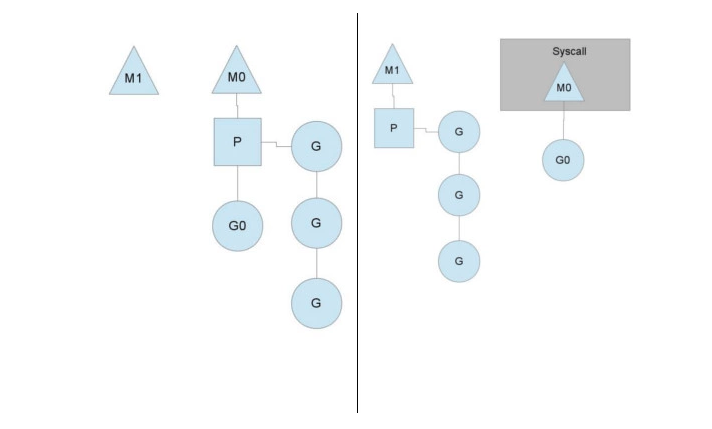

协程，又称微线程，纤程。英文名Coroutine。

## 优势

看起来A、B的执行有点像多线程，但协程的特点在于是**一个线程执行**，那和多线程比，协程有何**优势**？

- 最大的优势就是协程极高的执行效率。因为子程序切换不是线程切换，而是由**程序自身控制**，因此，没有线程切换的开销，和多线程比，线程数量越多，协程的性能优势就越明显。

- 第二大优势就是不需要多线程的锁机制，因为只有一个线程，也**不存在同时写变量冲突**，在协程中控制**共享资源不加锁**，只需要判断状态就好了，所以执行效率比多线程高很多。

因为协程是一个线程执行，那怎么利用多核CPU呢？最简单的方法是**多进程+协程**，既充分利用多核，又充分发挥协程的高效率，可获得极高的性能。

- [Python协程详解](https://juejin.im/post/5d888151f265da03dd3db0f5)

---

## 总结
- 进程拥有自己独立的堆和栈，既不共享堆，亦不共享栈，进程由操作系统调度
- 线程拥有自己独立的栈和共享的堆，共享堆，不共享栈，线程亦由操作系统调度(标准线程是的)
- 协程和线程一样**共享堆，不共享栈**，协程由程序员在协程的代码里显示调度

- [链接](https://www.jianshu.com/p/ccf3bd34340f)

---
## selectors

selectors 模块在基于 [select](https://pymotw.com/3/select/index.html#module-select) 里面平台特定的方法之上提供了一个平台无关的抽象层。(DefaultSelector：封装各个平台的异步,如epoll)

- [标准库实例](https://learnku.com/docs/pymotw/selectors-io-multiplexing-abstractions/3428)

---
- [谈谈Python协程技术的演进](https://segmentfault.com/a/1190000012291369)

# 谈Python协程技术的演进

## 同步编程
同步编程的改进方式有多进程、多线程，但对于 c10k 问题都不是良好的解决方案，多进程的方式存在操作系统可调度进程数量**上限较低**，进程间**上下文切换时间过长，进程间通信较为复杂**。

而 Python 的多线程方式，由于存在众所周知的**GIL 锁**，性能提升并不稳定，仅能满足成百上千规模的 I/O 密集型任务，多线程还有一个**缺点**是由**操作系统进行抢占式调度存在竞态条件**，可能需要引入了**锁与队列**等保障**原子性操作**的工具。

## 异步编程

它的作用是将**大量的文件描述符托管给内核**，内核将最底层的 I/O 状态变化封装成读写事件，这样就避免了由程序员去**主动轮询**状态变化的重复工作，程序员将回调函数注册到 epoll 的状态上，当检测到相对应文件描述符产生**状态变化**时，就进行函数回调。

对事件集合进行轮询，调用回调函数等,一轮事件循环结束，循环往复。

EventLoop**屏蔽**了进行epoll系统调用的具体操作。对于用户来说，将不同的I/O状态考量为**事件的触发**，只需关注**更高层次**下不同事件的回调行为。诸如libev, libevent之类的使用C编写的**高性能异步事件库**已经取代这部分琐碎的工作。

### python框架
在**Python框架**里一般会见到的这几种事件循环：
- libevent/libev: Gevent(greenlet+前期libevent，后期libev)使用的网络库，广泛应用；
- tornado: tornado框架自己实现的IOLOOP；
- picoev: meinheld(greenlet+picoev)使用的网络库，小巧轻量，相较于libevent在数据结构和事件检测模型上做了改进，所以速度更快。但从github看起来已经年久失修，用的人不多。
- uvloop: Python3时代的新起之秀。Guido操刀打造了asyncio库，asyncio可以配置可插拔的event loop，但需要满足相关的API要求，**uvloop继承自libuv**，将一些低层的结构体和函数用Python对象包装。目前Sanic框架基于这个库

> Libevent、libev、libuv

## 协程

> 好处：替代回调，简化问题。近似同步代码进行编程。[回调与协程](https://www.cnblogs.com/xybaby/p/6406191.html)

EventLoop简化了不同平台上的事件处理，但是**处理事件触发时的回调依然很麻烦**，响应式的异步程序编写对程序员的心智是一项不小的麻烦。
因此，协程被引入来**替代回调以简化问题**。协程模型主要在在以下方面**优于**回调模型：

- 以**近似同步代码**的编程模式取代异步回调模式，真实的业务逻辑往往是同步线性推演的，因此，这种同步式的代码写起来更加容易。底层的回调依然是callback hell，但这部分脏活累活已经转交给编译器与解释器去完成，程序员不易出错。

- **异常处理更加健全**，可以复用语言内的错误处理机制，回调方式。而传统异步回调模式需要自己判定成功失败，错误处理行为复杂化。

- **上下文管理简单化**，回调方式代码上下文管理**严重依赖闭包**，不同的回调函数之间相互耦合，割裂了相同的上下文处理逻辑。协程直接利用代码的执行位置来表示状态，而回调则是维护了一堆数据结构来处理状态。

- 方便处理**并发**行为，协程的开销成本很低，每一个协程仅有一个轻巧的**用户态栈**空间。

## EventLoop与协程的发展史 

近十年以来，后端领域内古老的**子例程与事件循环**得到结合，协程(**协作式子例程**)快速发展，并也革新与诞生了一些语言，比如 golang 的 goroutine，luajit 的 coroutine，Python 的 gevent,erlang 的 process，scala 的 actor 等。

就不同语言中面向并发设计的协程实现而言，Scala 与 Erlang 的**Actor** 模型、Golang 中的 goroutine 都较 Python 更为**成熟**，不同的协程使用**通信**来**共享内存**，优化了**竞态、冲突、不一致性**等问题。然而，根本的理念没有区别，都是在用户态通过事件循环驱动实现调度。

由于历史包袱较少，后端语言上的各种异步技术除 Python Twisted 外基本也没有 callback hell 的存在。其他的方案都已经将 callback hell 的过程进行**封装**，交给**库代码、编译器、解释器**去解决。

## Gevent
Gevent 基于 Greenlet 与 Libev，greenlet 是一种微线程或者协程，在**调度粒度上比 PY3 的协程更大**。greenlet 存在于线程容器中，其行为类似线程，有自己独立的栈空间，不同的 greenlet 的切换**类似操作系统层的线程切换**。

## 总结
从 Python 语言发展的角度来说，async/await 并非是多么伟大的改进，只是引进了其他语言中成熟的语义，协程的基石还是在于 eventloop 库的发展，以及生成器的完善。从结构原理而言，asyncio 实质担当的**角色**是一个**异步框架**，async/await 是为**异步框架提供的 API**，因为使用者目前并**不能脱离** asyncio 或其他异步库使用 async/await 编写协程代码。即使用户可以避免**显式地**实例化事件循环，比如支持 asyncio/await 语法的协程网络库 curio，但是脱离了 eventloop 如心脏般的驱动作用，async/await 关键字本身也毫无作用。

---
# 协程源码

asyncio.unix_events._UnixSelectorEventLoop: Unix event loop.Adds signal handling and UNIX Domain Socket support to SelectorEventLoop.
asyncio.unix_events._UnixDefaultEventLoopPolicy：UNIX event loop policy with a watcher for child processes.
asyncio.unix_events._UnixSelectorEventLoop.create_unix_server: 创建socket
asyncio.selector_events.BaseSelectorEventLoop._start_serving: epoll事件注册与启动

# TODO: 协程各个语言的对比

---
- [Go goroutine理解](https://segmentfault.com/a/1190000018150987)

## 线程与协程

- 线程（Thread）：有时被称为轻量级进程(Lightweight Process，LWP），是程序执行流的**最小单元**。一个标准的线程由**线程ID，当前指令指针(PC），寄存器集合和堆栈**组成。另外，线程是进程中的一个实体，是被系统独立调度和分派的**基本单位**，线程自己**不拥有系统资源**，只拥有一点儿在运行中必不可少的资源，但它可与同属一个进程的其它线程**共享进程所拥有的全部资源**。

线程拥有自己独立的栈和共享的堆，共享堆，不共享栈，线程的切换一般也**由操作系统调度**。

- 协程（coroutine）：又称微线程与子例程（或者称为函数）一样，协程（coroutine）也是一种程序组件。相对子例程而言，协程更为一般和灵活，但在实践中使用没有子例程那样广泛。

和线程类似，共享堆，不共享栈，协程的切换一般由程序员在代码中**显式控制**。它避免了**上下文切换的额外耗费，兼顾了多线程的优点，简化了高并发程序的复杂**。

Goroutine和其他语言的协程（coroutine）在使用方式上**类似**，但从字面意义上来看不同（一个是Goroutine，一个是coroutine），再就是协程是一种**协作任务控制机制**，在最简单的意义上，**协程不是并发的**，而Goroutine支持并发的。因此Goroutine可以理解为一种Go语言的协程。同时它可以**运行在一个或多个线程上**。

> 协程与goroutine的区别: 并发，多线程

## GO并发的实现原理 

Go实现了两种并发形式。

- 第一种是大家普遍认知的：**多线程共享内存**。其实就是Java或者C++等语言中的多线程开发。

- 另外一种是Go语言特有的，也是Go语言推荐的：**CSP**（communicating sequential processes）并发模型。

CSP并发模型是在1970年左右提出的概念，属于比较新的概念，不同于传统的**多线程通过共享内存**来通信，CSP讲究的是“以**通信的方式**来**共享内存**”。

普通的线程并发模型，就是像Java、C++、或者Python，他们线程间通信都是通过共享内存的方式来进行的。非常典型的方式就是，在访问共享数据（例如数组、Map、或者某个结构体或对象）的时候，通过**锁**来访问，因此，在很多时候，衍生出一种方便操作的数据结构，叫做“**线程安全的数据结构**”。例如Java提供的包”java.util.concurrent”中的数据结构。Go中**也**实现了传统的线程并发模型。

Go的CSP并发模型，是通过goroutine和channel来实现的。

- goroutine 是Go语言中并发的**执行单位**。有点抽象，其实就是和传统概念上的”线程“类似，可以理解为”线程“。
- channel是Go语言中各个并发结构体(goroutine)之前的**通信机制**。 通俗的讲，就是各个goroutine之间通信的”**管道**“，有点类似于Linux中的管道。

> 而且不管传还是取，必阻塞，直到另外的goroutine传或者取为止。

## GO并发模型的实现原理

我们先从线程讲起，无论语言层面何种并发模型，到了操作系统层面，**一定**是以**线程的形态**存在的。而操作系统根据资源访问权限的不同，体系架构可分为**用户空间和内核空间**；内核空间主要操作访问CPU资源、I/O资源、内存资源等**硬件资源**，为上层应用程序**提供**最基本的基础资源，用户空间呢就是上层应用程序的**固定活动空间**，用户空间不可以**直接**访问资源，必须通过“系统调用”、“库函数”或“Shell脚本”来调用**内核空间提供的资源**。

我们现在的计算机语言，可以狭义的认为是一种“软件”，它们中所谓的“线程”，往往是**用户态的线程**，和操作系统本身**内核态的线程**（简称KSE），还是有区别的。

### 用户级线程模型

如图所示，多个用户态的线程对应着一个内核线程，程序线程的创建、终止、切换或者同步等线程工作必须自身来完成。它可以做**快速的上下文切换**。缺点是**不能有效利用多核CPU**。

> 有点类似python的协程

### 内核级线程模型
这种模型直接调用操作系统的**内核线程**，所有线程的创建、终止、切换、同步等操作，都由**内核**来完成。一个用户态的线程**对应**一个系统线程，它可以利用多核机制，但上下文切换需要**消耗额外**的资源。C++就是这种。

### 两级线程模型
M个用户线程对应N个系统线程，缺点增加了**调度器的实现难度**。

Go语言的线程模型就是一种特殊的两级线程模型（GPM调度模型）。

## Go线程实现模型MPG

- M指的是Machine，一个M直接关联了一个**内核线程**。由操作系统管理。
- P指的是”processor”，代表了M所需的**上下文环境**，也是处理**用户级**代码逻辑的**处理器**。它负责衔接M和G的调度上下文，将等待执行的G与M对接。
- G指的是Goroutine，其实本质上也是一种**轻量级的线程**。包括了调用栈，重要的调度信息，例如channel等。

P的数量由环境变量中的GOMAXPROCS决定，通常来说它是和**核心数**对应，例如在4Core的服务器上回启动4个线程。G会有很多个，每个P会将Goroutine从一个**就绪的队列**中做**Pop**操作，为了**减小锁的竞争**，通常情况下**每个P会负责一个队列**。

> 多线程调度器的主要问题是调度时的锁竞争会严重浪费资源

上下文P(Processor)的数量在启动时设置为GOMAXPROCS环境变量的值或通过运行时函数GOMAXPROCS()。通常情况下，在程序执行期间不会更改。上下文数量固定意味着**只有固定数量的线程在任何时候运行Go代码**。我们可以使用它来调整Go进程到个人计算机的调用，例如4核PC在4个线程上运行Go代码。

> 所以多线程调度器引入了 GOMAXPROCS 变量帮助我们灵活控制程序中的最大处理器数，即活跃线程数。

## 抛弃P(Processor)
你可能会想，为什么一定需要一个上下文，我们能不能直接除去上下文，让Goroutine的runqueues挂到M上呢？答案是不行，需要上下文的**目的**，是让我们可以直接**放开**其他线程，当遇到**内核线程阻塞**的时候。

一个很简单的例子就是系统调用sysall，一个线程肯定不能同时执行代码和系统调用被阻塞，这个时候，此线程M需要放弃当前的上下文环境P，以便可以让其他的Goroutine被调度执行。

M0中的G0执行了syscall，然后就**创建了一个M1(也有可能来自线程缓存)**，（转向右图）然后M0**丢弃**了P，等待syscall的返回值，M1接受了P，将·**继续执行**Goroutine队列中的其他Goroutine。

当系统调用syscall结束后，M0会“**偷**”一个上下文，如果不成功，M0就把它的Gouroutine G0放到一个全局的**runqueue**中，将自己置于**线程缓存**中并进入**休眠状态**。全局runqueue是各个P在运行完自己的本地的Goroutine runqueue后用来拉取新goroutine的地方。P也会**周期性的检查**这个全局runqueue上的goroutine，否则，全局runqueue上的goroutines可能得不到执行而饿死。

> 理解：M内核线程是动态扩展的，P代表的是处理器，则是固定的？

## 均衡的分配工作

按照以上的说法，上下文P会定期的检查全局的goroutine 队列中的goroutine，以便自己在消费掉自身Goroutine队列的时候有事可做。假如全局goroutine队列中的goroutine也没了呢？就从其他运行的中的P的runqueue里偷。

每个P中的Goroutine不同导致他们运行的效率和时间也不同，在一个有很多P和M的环境中，不能让一个P跑完自身的Goroutine就没事可做了，因为或许其他的P有很长的goroutine队列要跑，得需要均衡。
该如何解决呢？

Go的做法倒也直接，从其他P中偷一半！

## 总结

### 优点：

1、开销小

POSIX的thread API虽然能够提供丰富的API，例如配置自己的CPU亲和性，申请资源等等，线程在得到了很多与进程相同的控制权的同时，开销也非常的大，在Goroutine中则不需这些**额外的开销**，所以一个Golang的程序中可以支持10w级别的Goroutine。

每个 goroutine (协程) 默认占用内存远比 Java 、C 的线程少（**goroutine：2KB ，线程：8MB**）

2、调度性能好

在Golang的程序中，操作系统级别的线程调度，通常不会做出合适的**调度决策**。例如在GC时，内存必须要达到一个一致的状态。在Goroutine机制里，Golang可以控制Goroutine的调度，从而在一个合适的时间进行GC。

> 在应用层**模拟的线程**，它避免了**上下文切换的额外耗费，兼顾了多线程的优点。简化了高并发程序的复杂度**。

### 缺点：

协程调度机制无法实现公平调度。

---

- [TODO:为什么Goroutine能有上百万个，Java线程却只能有上千个？](https://mp.weixin.qq.com/s/v-Q5aOnYVj7l-kMQopkPLA)

--- 

- [调度器](https://draveness.me/golang/docs/part3-runtime/ch06-concurrency/golang-goroutine/)

> Go 语言的调度器通过使用与 CPU 数量相等的线程减少线程频繁切换的内存开销，同时在每一个线程上执行额外开销更低的 Goroutine 来降低操作系统和硬件的负载。
  
## 任务窃取调度器
2012 年 Google 的工程师 Dmitry Vyukov 在 Scalable Go Scheduler Design Doc 中指出了现有多线程调度器的问题并在多线程调度器上提出了两个改进的手段：

- 在当前的 G-M 模型中引入了处理器 P，增加中间层；
- 在处理器 P 的基础上实现基于工作窃取的调度器；

## 抢占式调度器
对 Go 语言并发模型的修改提升了调度器的性能，但是 1.1 版本中的调度器仍然不支持抢占式调度，程序只能依靠 Goroutine 主动让出 CPU 资源才能触发调度。Go 语言的调度器在 1.2 版本中引入基于协作的抢占式调度解决下面的问题：

- 某些 Goroutine 可以长时间占用线程，造成其它 Goroutine 的饥饿；
- 垃圾回收需要暂停整个程序（Stop-the-world，STW），最长可能需要几分钟的时间6，导致整个程序无法工作；

1.2 版本的抢占式调度虽然能够缓解这个问题，但是它实现的抢占式调度是基于协作的，在之后很长的一段时间里 Go 语言的调度器都有一些无法被抢占的边缘情况，例如：for 循环或者垃圾回收长时间占用线程，这些问题中的一部分直到 1.14 才被基于信号的抢占式调度解决。

## G

Gorotuine 就是 Go 语言调度器中待执行的任务，它在运行时调度器中的地位与线程在操作系统中差不多，但是它占用了更小的内存空间，也降低了上下文切换的开销。

Goroutine 只存在于 Go 语言的运行时，它是 Go 语言在用户态提供的线程，作为一种粒度更细的资源调度单元，如果使用得当能够在高并发的场景下更高效地利用机器的 CPU。

## M

Go 语言并发模型中的 M 是操作系统线程。调度器最多可以创建 10000 个线程，但是其中大多数的线程都不会执行用户代码（可能陷入系统调用），最多只会有 GOMAXPROCS 个活跃线程能够正常运行。

在大多数情况下，我们都会使用 Go 的默认设置，也就是线程数等于 CPU 个数，在这种情况下不会触发操作系统的线程调度和上下文切换，所有的调度都会发生在用户态，由 Go 语言调度器触发，能够减少非常多的额外开销。

## P
调度器中的处理器 P 是线程和 Goroutine 的中间层，它能提供线程需要的上下文环境，也会负责**调度**线程上的等待队列，通过处理器 P 的调度，每一个内核线程都能够执行多个 Goroutine，它能在 Goroutine 进行一些 I/O 操作时及时切换，提高线程的利用率。

因为调度器在启动时就会创建 GOMAXPROCS 个处理器，所以 Go 语言程序的处理器数量一定会等于 GOMAXPROCS，这些处理器会绑定到不同的内核线程上并利用线程的计算资源运行 Goroutine。

