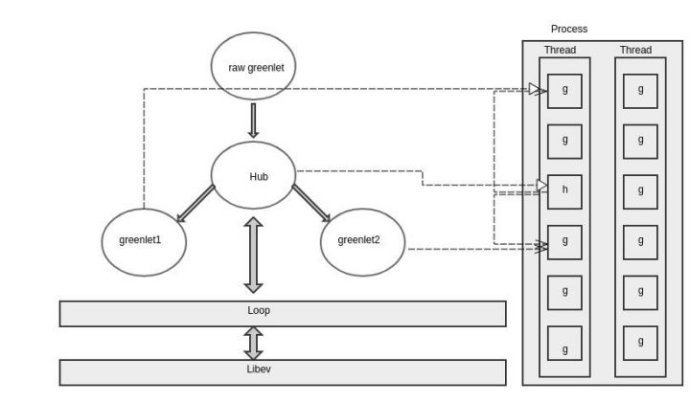
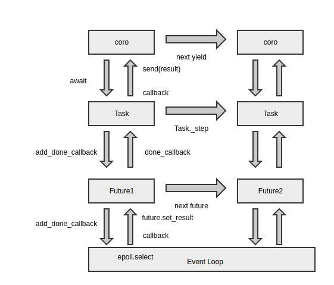

协程，又称微线程，纤程。英文名Coroutine。

## 优势

看起来A、B的执行有点像多线程，但协程的特点在于是**一个线程执行**，那和多线程比，协程有何**优势**？

- 最大的优势就是协程极高的执行效率。因为子程序切换不是线程切换，而是由**程序自身控制**，因此，没有线程切换的开销，和多线程比，线程数量越多，协程的性能优势就越明显。

- 第二大优势就是不需要多线程的锁机制，因为只有一个线程，也**不存在同时写变量冲突**，在协程中控制**共享资源不加锁**，只需要判断状态就好了，所以执行效率比多线程高很多。

因为协程是一个线程执行，那怎么利用多核CPU呢？最简单的方法是**多进程+协程**，既充分利用多核，又充分发挥协程的高效率，可获得极高的性能。

- [Python协程详解](https://juejin.im/post/5d888151f265da03dd3db0f5)

---

## 总结
- 进程拥有自己独立的堆和栈，既不共享堆，亦不共享栈，进程由操作系统调度
- 线程拥有自己独立的栈和共享的堆，共享堆，不共享栈，线程亦由操作系统调度(标准线程是的)
- 协程和线程一样**共享堆，不共享栈**，协程由程序员在协程的代码里显示调度

- [链接](https://www.jianshu.com/p/ccf3bd34340f)

---
## selectors

selectors 模块在基于 [select](https://pymotw.com/3/select/index.html#module-select) 里面平台特定的方法之上提供了一个平台无关的抽象层。(DefaultSelector：封装各个平台的异步,如epoll)

- [标准库实例](https://learnku.com/docs/pymotw/selectors-io-multiplexing-abstractions/3428)

---
- [谈谈Python协程技术的演进](https://segmentfault.com/a/1190000012291369)

# 谈Python协程技术的演进

## 同步编程
同步编程的改进方式有多进程、多线程，但对于 c10k 问题都不是良好的解决方案，多进程的方式存在操作系统可调度进程数量**上限较低**，进程间**上下文切换时间过长，进程间通信较为复杂**。

而 Python 的多线程方式，由于存在众所周知的**GIL 锁**，性能提升并不稳定，仅能满足成百上千规模的 I/O 密集型任务，多线程还有一个**缺点**是由**操作系统进行抢占式调度存在竞态条件**，可能需要引入了**锁与队列**等保障**原子性操作**的工具。

## 异步编程

它的作用是将**大量的文件描述符托管给内核**，内核将最底层的 I/O 状态变化封装成读写事件，这样就避免了由程序员去**主动轮询**状态变化的重复工作，程序员将回调函数注册到 epoll 的状态上，当检测到相对应文件描述符产生**状态变化**时，就进行函数回调。

对事件集合进行轮询，调用回调函数等,一轮事件循环结束，循环往复。

EventLoop**屏蔽**了进行epoll系统调用的具体操作。对于用户来说，将不同的I/O状态考量为**事件的触发**，只需关注**更高层次**下不同事件的回调行为。诸如libev, libevent之类的使用C编写的**高性能异步事件库**已经取代这部分琐碎的工作。

### python框架
在**Python框架**里一般会见到的这几种事件循环：
- libevent/libev: Gevent(greenlet+前期libevent，后期libev)使用的网络库，广泛应用；
- tornado: tornado框架自己实现的IOLOOP；
- picoev: meinheld(greenlet+picoev)使用的网络库，小巧轻量，相较于libevent在数据结构和事件检测模型上做了改进，所以速度更快。但从github看起来已经年久失修，用的人不多。
- uvloop: Python3时代的新起之秀。Guido操刀打造了asyncio库，asyncio可以配置可插拔的event loop，但需要满足相关的API要求，**uvloop继承自libuv**，将一些低层的结构体和函数用Python对象包装。目前Sanic框架基于这个库

## 协程

> 好处：替代回调，简化问题。近似同步代码进行编程。[回调与协程](https://www.cnblogs.com/xybaby/p/6406191.html)

EventLoop简化了不同平台上的事件处理，但是**处理事件触发时的回调依然很麻烦**，响应式的异步程序编写对程序员的心智是一项不小的麻烦。
因此，协程被引入来**替代回调以简化问题**。协程模型主要在在以下方面**优于**回调模型：

- 以**近似同步代码**的编程模式取代异步回调模式，真实的业务逻辑往往是同步线性推演的，因此，这种同步式的代码写起来更加容易。底层的回调依然是callback hell，但这部分脏活累活已经转交给编译器与解释器去完成，程序员不易出错。

- **异常处理更加健全**，可以复用语言内的错误处理机制，回调方式。而传统异步回调模式需要自己判定成功失败，错误处理行为复杂化。

- **上下文管理简单化**，回调方式代码上下文管理**严重依赖闭包**，不同的回调函数之间相互耦合，割裂了相同的上下文处理逻辑。协程直接利用代码的执行位置来表示状态，而回调则是维护了一堆数据结构来处理状态。

- 方便处理**并发**行为，协程的开销成本很低，每一个协程仅有一个轻巧的**用户态栈**空间。

## EventLoop与协程的发展史 

近十年以来，后端领域内古老的**子例程与事件循环**得到结合，协程(**协作式子例程**)快速发展，并也革新与诞生了一些语言，比如 golang 的 goroutine，luajit 的 coroutine，Python 的 gevent,erlang 的 process，scala 的 actor 等。

就不同语言中面向并发设计的协程实现而言，Scala 与 Erlang 的**Actor** 模型、Golang 中的 goroutine 都较 Python 更为**成熟**，不同的协程使用**通信**来**共享内存**，优化了**竞态、冲突、不一致性**等问题。然而，根本的理念没有区别，都是在用户态通过事件循环驱动实现调度。

由于历史包袱较少，后端语言上的各种异步技术除 Python Twisted 外基本也没有 callback hell 的存在。其他的方案都已经将 callback hell 的过程进行**封装**，交给**库代码、编译器、解释器**去解决。

## Gevent
Gevent 基于 Greenlet 与 Libev，greenlet 是一种微线程或者协程，在**调度粒度上比 PY3 的协程更大**。greenlet 存在于线程容器中，其行为类似线程，有自己独立的栈空间，不同的 greenlet 的切换**类似操作系统层的线程切换**。

greenlet.hub 也是一个继承于原生 greenlet 的对象，也是其他 greenlet 的父节点，它主要负责任务调度。当一个 greenlet 协程执行完部分例程后到达断点，通过 greenlet.switch() 向上转交控制权给 hub 对象，hub 执行上下文切换的操作：从寄存器、高速缓存中备份当前 greenlet 的栈内容到内存中，并将原来备份的另一个 greenlet 栈数据恢复到寄存器中。

hub 对象内封装了一个 loop 对象，loop 负责封装 libev 的相关操作并向上提供接口，所有 greenlet 在通过 loop 驱动的 hub 下被调度。

## async

### Future
不用回调方法编写异步代码后，为了获取异步调用的结果，引入一个 Future 未来对象。Future 封装了与 loop 的交互行为，add_done_callback 方法向 epoll 注册回调函数，当 result 属性得到返回值后，会运行之前注册的回调函数，向上传递给 coroutine。

但是，每一个角色各有自己的职责，用 Future 向生成器 send result 以恢复工作状态并不合适，Future 对象本身的生存周期比较短，每一次注册回调、产生事件、触发回调过程后工作已经完成。所以这里又需要在生成器协程与 Future 对象中引入一个新的对象 Task，对生成器协程进行状态管理。

### Task
Task，顾名思义，是维护生成器协程状态处理执行逻辑的的任务，Task 内的_step 方法负责生成器协程与 EventLoop 交互过程的状态迁移:向协程 send 一个值，恢复其工作状态，协程运行到断点后，得到新的未来对象，再处理 future 与 loop 的回调注册过程。

###  Loop
事件循环的工作方式与用户设想存在一些偏差，理所当然的认知应是每个线程都可以有一个独立的 loop。但是在运行中，在主线程中才能通过 asyncio.get_event_loop() 创建一个新的 loop，而在其他线程时，使用 get_event_loop() 却会抛错，正确的做法应该是 asyncio.set_event_loop() 进行当前线程与 loop 的显式绑定。由于 loop 的运作行为并不受 Python 代码的控制，所以无法稳定的将协程拓展到多线程中运行。

协程在工作时，并不了解是哪个 loop 在对其调度，即使调用 asyncio.get_event_loop() 也不一定能获取到真正运行的那个 loop。因此在各种库代码中，实例化对象时都必须显式的传递当前的 loop 以进行绑定。

---

## 总结
从 Python 语言发展的角度来说，async/await 并非是多么伟大的改进，只是引进了其他语言中成熟的语义，协程的基石还是在于 eventloop 库的发展，以及生成器的完善。从结构原理而言，asyncio 实质担当的**角色**是一个**异步框架**，async/await 是为**异步框架提供的 API**，因为使用者目前并**不能脱离** asyncio 或其他异步库使用 async/await 编写协程代码。即使用户可以避免**显式地**实例化事件循环，比如支持 asyncio/await 语法的协程网络库 curio，但是脱离了 eventloop 如心脏般的驱动作用，async/await 关键字本身也毫无作用。

## 现阶段asyncio生态发展的困难

- 由于这两个关键字在2014年发布的Python3.5中才被引入，发展历史较短，在Python2与Python3割裂的大环境下，生态环境的建立并不完善；

- 对于使用者来说，希望的逻辑是引入一个库然后调用并获取结果，并不关心第三方库的内部逻辑。然而使用协程编写异步代码时需要处理与事件循环的交互。对于异步库来说，其对外封装性并不能达到同步库那么高。异步编程时，用户通常只会选择一个第三方库来处理所有HTTP逻辑。但是不同的异步实现方法不一致，互不兼容，分歧阻碍了社区壮大；

- 异步代码虽然快，但不能阻塞，一旦阻塞整个程序失效。使用多线程或多进程的方式将调度权交给操作系统，未免不是一种自我保护；

---
# 协程源码

asyncio.unix_events._UnixSelectorEventLoop: Unix event loop.Adds signal handling and UNIX Domain Socket support to SelectorEventLoop.
asyncio.unix_events._UnixDefaultEventLoopPolicy：UNIX event loop policy with a watcher for child processes.
asyncio.unix_events._UnixSelectorEventLoop.create_unix_server: 创建socket
asyncio.selector_events.BaseSelectorEventLoop._start_serving: epoll事件注册与启动

- [asyncio](https://docs.python.org/zh-cn/3/library/asyncio-task.html)

---

# TODO: 协程各个语言的对比

- [go](./../go/goroutine.md)

---

# Torando适配Uvloop与Asyncio下的性能简测

Python3.5+ 的标准库asyncio提供了事件循环用来实现协程，并引入了async/await关键字语法以定义协程。Tornado通过yield生成器实现协程，它自身实现了一个事件循环。由于一些三方库都是基于asyncio进行，为了更好的使用python3新特效带来的异步IO，实际测试了Tornado在不同的事件循环中的性能，以及搭配三方库（motor，asyncpg，aiomysql）的方式。

使用tornado默认的事件循环驱动app，IOLoop会创建一个事件循环，用于响应epoll事件，并调用响应的handler处理请求。

Tornado提供了一个异步的HTTPClient，用于handler中访问三方的api，即使当前的三方api访问被阻塞了，也不会阻塞tornado响应其他的handler。

Aysnc定义协程方式基本符合tornado的协程，但是毕竟不是全兼容了。例如asyncio.sleep 将不会work。使用 tornado_asyncio.AsyncIOMainLoop() 可以替换默认的ioloop。

除了标准库asyncio的事件循环，社区使用Cython实现了另外一个事件循环uvloop。用来取代标准库。号称是性能最好的python异步IO库。使用uvloop的方式如下：

因为数据库读写都是non-block，因此db和mongodb模式都会因请求的增长而增长，当瞬时达到最大连接数将会raise异常。而pool的方式会等待连接释放，再发起数据库查询。而且性能最好。aiomysql的连接池方式与pq类似。

> 在同步带 mysql 驱动中，经常维护一个mysql长连接。而异步的驱动则不能这样，因为一个连接阻塞了，另外的协程还是无法读取这个连接。最好的方式还是使用连接池管理连接。

## 结论
Tornado的作者也指出过，他的测试过程中，使用asyncio和tornado自带的epoll事件循环性能差不多。并且tornado5.0会考虑完全吸纳asyncio。在此之前，使用tornado无论是使用自带的事件循环还是asyncio活着uvloop，在性能方面上都差不不大。需要兼容数据库或http库的时候，使用uvloop的驱动方式，兼容性最好~

> 参考链接有相应的压测过程，可以学习下。

- [Torando适配Uvloop与Asyncio下的性能简测](https://www.jianshu.com/p/6d6fa94a01ef)
- [Libevent、libev、libuv](./../network/网络库.md)
