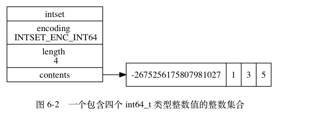

# 整数集合

整数集合（intset）是集合键的底层实现之一： 当一个集合只包含整数值元素， 并且这个集合的元素数量不多时， Redis 就会使用整数集合作为集合键的底层实现。]

## 实现

整数集合（intset）是 Redis 用于保存整数值的集合抽象数据结构， 它可以保存类型为 int16_t 、 int32_t 或者 int64_t 的整数值， 并且保证集合中不会出现重复元素。

```shell script
typedef struct intset {

    // 编码方式
    uint32_t encoding;

    // 集合包含的元素数量
    uint32_t length;

    // 保存元素的数组
    int8_t contents[];

} intset;
```

contents 数组是整数集合的底层实现： 整数集合的每个元素都是 contents 数组的一个数组项（item）， 各个项在数组中按值的大小从小到大有序地排列， 并且数组中不包含任何重复项。

length 属性记录了整数集合包含的元素数量， 也即是 contents 数组的长度。

虽然 intset 结构将 contents 属性声明为 int8_t 类型的数组， 但实际上 contents 数组并不保存任何 int8_t 类型的值 —— contents 数组的真正类型取决于 encoding 属性的值

整数集合示例:
- encoding 属性的值为 INTSET_ENC_INT64 ， 表示整数集合的底层实现为 int64_t 类型的数组， 而数组中保存的都是 int64_t 类型的整数值。
- length 属性的值为 4 ， 表示整数集合包含四个元素。
- contents 数组按从小到大的顺序保存着集合中的四个元素。
- 因为每个集合元素都是 int64_t 类型的整数值， 所以 contents 数组的大小为 sizeof(int64_t) * 4 = 64 * 4 = 256 位。



当向一个底层为 int16_t 数组的整数集合添加一个 int64_t 类型的整数值时， 整数集合已有的所有元素都会被转换成 int64_t 类型， 所以 contents 数组保存的四个整数值都是 int64_t 类型的

## 升级

每当我们要将一个新元素添加到整数集合里面， 并且新元素的类型比整数集合现有所有元素的类型都要长时， 整数集合需要先进行升级（upgrade）， 然后才能将新元素添加到整数集合里面。

升级整数集合并添加新元素共分为三步进行：

- 根据新元素的类型， 扩展整数集合底层数组的空间大小， 并为新元素分配空间。
- 将底层数组现有的所有元素都转换成与新元素相同的类型， 并将类型转换后的元素放置到正确的位上， 而且在放置元素的过程中， 需要继续维持底层数组的**有序性质**不变。
- 将新元素添加到底层数组里面。

因为每次向整数集合添加新元素都可能会引起升级， 而每次升级都需要对底层数组中已有的所有元素进行类型转换， 所以向整数集合添加新元素的时间复杂度为 O(N) 。

### 升级之后新元素的摆放位置

因为引发升级的新元素的长度**总是**比整数集合现有所有元素的长度都大， 所以这个新元素的值要么就**大于**所有现有元素， 要么就**小于**所有现有元素：

- 在新元素小于所有现有元素的情况下， 新元素会被放置在底层数组的最开头（索引 0 ）；
- 在新元素大于所有现有元素的情况下， 新元素会被放置在底层数组的最末尾（索引 length-1 ）。

> Q：升级代表总是比新元素长度都大，那为什么会小于现有的元素？ A：负值

## 升级的好处

整数集合的升级策略有两个好处， 一个是提升整数集合的灵活性， 另一个是尽可能地节约内存。

### 提升灵活性

因为 C 语言是静态类型语言， 为了避免类型错误， 我们通常不会将两种不同类型的值放在同一个数据结构里面。

但是， 因为整数集合可以通过自动升级底层数组来适应新元素， 所以我们可以随意地将 int16_t 、 int32_t 或者 int64_t 类型的整数添加到集合中， 而不必担心出现类型错误， 这种做法非常灵活。

### 节约内存

当然， 要让一个数组可以同时保存 int16_t 、 int32_t 、 int64_t 三种类型的值， 最简单的做法就是直接使用 int64_t 类型的数组作为整数集合的底层实现。 不过这样一来， 即使添加到整数集合里面的都是 int16_t 类型或者 int32_t 类型的值， 数组都需要使用 int64_t 类型的空间去保存它们， 从而出现浪费内存的情况。

而整数集合现在的做法既可以让集合能同时保存三种不同类型的值， 又可以确保升级操作只会在有需要的时候进行， 这可以尽量节省内存。

比如说， 如果我们一直只向整数集合添加 int16_t 类型的值， 那么整数集合的底层实现就会一直是 int16_t 类型的数组， 只有在我们要将 int32_t 类型或者 int64_t 类型的值添加到集合时， 程序才会对数组进行升级。

### 降级

整数集合不支持降级操作， 一旦对数组进行了升级， 编码就会一直保持升级后的状态。

## 总结

- 整数集合是集合键的底层实现之一。
- 整数集合的底层实现为数组， 这个数组以有序、无重复的方式保存集合元素， 在有需要时， 程序会根据新添加元素的类型， 改变这个数组的类型。
- 升级操作为整数集合带来了操作上的灵活性， 并且尽可能地节约了内存。
- 整数集合只支持升级操作， 不支持降级操作。

- [整数集合](http://redisbook.com/index.html)


---


- [Redis中的集合类型是怎么实现的？](https://mp.weixin.qq.com/s?__biz=MzA4NTg1MjM0Mg==&mid=2657261457&idx=1&sn=fe966f3825b81e9d50a2cf38dac9060c&chksm=84479e48b330175ea07905e791856cca5fc50694db9fd4c3485ba5dc097443e69f5ed28a34b5&scene=21#wechat_redirect)