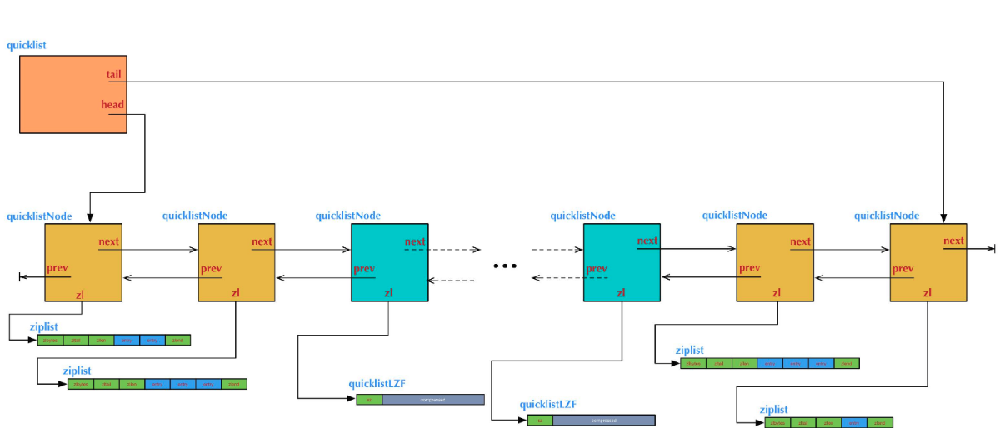

## [简述]

- Redis中的列表对象在版本3.2之前，列表底层的编码是ziplist和linkedlist实现的，但是在版本3.2之后，重新引入了一个 quicklist 的数据结构，列表的底层都由quicklist实现。

- 在早期的设计中， 当列表对象中元素的长度比较小或者数量比较少的时候，采用ziplist来存储，当列表对象中元素的长度比较大或者数量比较多的时候，则会转而使用双向列表linkedlist来存储。

这两种存储方式的优缺点

- 双向链表linkedlist便于在表的两端进行push和pop操作，在插入节点上复杂度很低，但是它的内存开销比较大。首先，它在每个节点上除了要保存数据之外，还要额外保存两个指针；其次，双向链表的各个节点是单独的内存块，地址不连续，节点多了容易产生内存碎片。
- ziplist存储在一段连续的内存上，所以存储效率很高。但是，它不利于修改操作，插入和删除操作需要频繁的申请和释放内存。特别是当ziplist长度很长的时候，一次realloc可能会导致大批量的数据拷贝。

  [简述]: https://juejin.im/post/5df9df506fb9a0160b6380f5
  
## quicklist

Redis对外暴露的list数据类型，它底层实现所依赖的**内部数据结构**就是quicklist。

Redis对外暴露的上层list数据类型，经常被用作**队列**使用。比如它支持的如下一些操作：

- lpush: 在左侧（即列表头部）插入数据。

- rpop: 在右侧（即列表尾部）删除数据。

- rpush: 在右侧（即列表尾部）插入数据。

- lpop: 在左侧（即列表头部）删除数据。

这些操作都是**O(1)**时间复杂度的。

当然，list也支持在任意中间位置的存取操作，比如lindex和linsert，但它们都需要对list进行**遍历**，所以**时间复杂度较高**。

概况起来，list具有这样的一些特点：它是一个有序列表，便于在表的两端追加和删除数据，而对于中间位置的存取具有O(N)的时间复杂度。这不正是一个**双向链表**所具有的特点吗？

> list的内部实现quicklist正是一个双向链表。而且是一个ziplist的双向链表。

双向链表是由多个节点（Node）组成的。这个描述的意思是：quicklist的**每个节点都是一个ziplist**。

ziplist本身也是一个**有序列表**，而且是一个**内存紧缩**的列表（各个数据项在内存上前后相邻）。比如，一个包含3个节点的quicklist，如果每个节点的ziplist又包含4个数据项，那么对外表现上，这个list就总共包含12个数据项。

## 设计理由
quicklist的结构为什么这样设计呢？总结起来，大概又是一个**空间和时间的折中**：

- 双向链表便于在表的两端进行push和pop操作，但是它的**内存开销**比较大。首先，它在每个节点上除了要保存数据之外，还要**额外保存两个指针**；其次，双向链表的各个节点是**单独的内存块**，**地址不连续**，节点多了容易产生**内存碎片**。

- ziplist由于是**一整块连续内存**，所以**存储效率很高**。但是，它**不利于修改操作**，每次数据变动都会**引发一次内存的realloc**。特别是当ziplist长度很长的时候，一次realloc可能会**导致大批量的数据拷贝**，进一步**降低性能**。

于是，结合了**双向链表和ziplist的优点**，quicklist就应运而生了。

## 问题

到底一个quicklist节点包含多长的ziplist合适呢？

这又是一个需要找平衡点的难题。我们只从存储效率上分析一下：

- 每个quicklist节点上的**ziplist越短**，则**内存碎片越多**。内存碎片多了，有可能在内存中产生很多**无法被利用的小碎片**，从而**降低存储效率**。这种情况的极端是每个quicklist节点上的ziplist**只包含一个**数据项，这就蜕化成一个**普通的双向链表**了。

- 每个quicklist节点上的ziplist越长，则为ziplist**分配大块连续内存空间的难度就越大**。有可能出现内存里有**很多小块**的空闲空间（它们加起来很多），但却找不到一块**足够大**的空闲空间分配给ziplist的情况。这同样会**降低存储效率**。这种情况的极端是整个quicklist只有一个节点，所有的数据项都分配在这仅有的一个节点的ziplist里面。这其实蜕化成一个ziplist了。

## 配置
实际上，Redis提供了一个配置参数`list-max-ziplist-size`，就是为了让使用者可以来根据自己的情况进行调整。

另外，list的设计目标是能够用来**存储很长的数据列表的**。比如，Redis官网给出的这个教程：[Writing a simple Twitter clone with PHP and Redis](http://redis.io/topics/twitter-clone)，就是使用list来存储类似Twitter的timeline数据。

当列表很长的时候，最容易被访问的很可能是**两端的数据**，中间的数据被访问的**频率比较低**（访问起来**性能也很低**）。如果应用场景符合这个特点，那么list还提供了一个选项，能够把**中间的数据节点进行压缩**，从而进一步**节省内存空间**。Redis的配置参数list-compress-depth就是用来完成这个设置的。

这个参数表示一个quicklist两端不被压缩的节点个数。注：这里的节点个数是指quicklist双向链表的节点个数，而不是指ziplist里面的数据项个数。实际上，一个quicklist节点上的ziplist，如果被压缩，就是整体被压缩的。

Redis对于quicklist内部节点的压缩算法，采用的[LZF](http://oldhome.schmorp.de/marc/liblzf.html)——一种**无损压缩算法**。

## 数据结构

不管是在头部还是尾部插入数据，都包含两种情况：

- 如果头节点（或尾节点）上ziplist大小没有超过限制（即_quicklistNodeAllowInsert返回1），那么新数据被**直接插入**到ziplist中（调用ziplistPush）。

- 如果头节点（或尾节点）上ziplist太大了，那么**新创建**一个quicklistNode节点（对应地也会新创建一个ziplist），然后把这个新创建的节点插入到quicklist双向链表中（调用_quicklistInsertNodeAfter）。

在_quicklistInsertNodeAfter的实现中，还会根据list-compress-depth的配置将里面的**节点进行压缩**。它的实现比较繁琐，我们这里就不展开讨论了。

quicklist不仅实现了从头部或尾部插入，也实现了从任意指定的位置插入。quicklistInsertAfter和quicklistInsertBefore就是分别在指定位置后面和前面插入数据项。这种在任意指定位置插入数据的操作，情况比较复杂，有众多的逻辑分支。

- 当插入位置所在的ziplist大小没有超过限制时，直接插入到ziplist中就好了；

- 当插入位置所在的ziplist大小超过了限制，但插入的位置位于ziplist两端，并且相邻的quicklist链表节点的ziplist大小没有超过限制，那么就转而插入到相邻的那个quicklist链表节点的ziplist中；

- 当插入位置所在的ziplist大小超过了限制，但插入的位置位于ziplist两端，并且相邻的quicklist链表节点的ziplist大小也超过限制，这时需要新创建一个quicklist链表节点插入。

- 对于插入位置所在的ziplist大小超过了限制的其它情况（主要对应于在ziplist中间插入数据的情况），则需要把当前ziplist分裂为两个节点，然后再其中一个节点上插入数据。

> 分裂和再调整

## 参考链接：

- [Redis内部数据结构详解(5)——quicklist](https://mp.weixin.qq.com/s?__biz=MzA4NTg1MjM0Mg==&mid=2657261335&idx=1&sn=053d72a348be2e78040f3847f4092d92&scene=21#wechat_redirect)