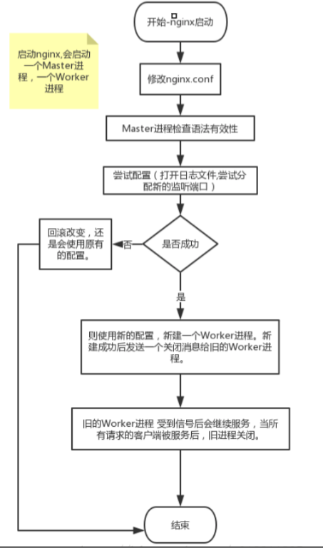

## Nginx 是如何实现高并发的?

异步，非阻塞，使用了epoll 和大量的底层代码优化。

如果一个server采用一个进程负责一个request的方式，那么进程数就是并发数。正常情况下，会有很多进程一直在等待中。

而nginx采用一个master进程，多个woker进程的模式。

- master进程主要负责收集、分发请求。每当一个请求过来时，master就拉起一个worker进程负责处理这个请求。
- 同时master进程也负责监控woker的状态，保证高可靠性
- woker进程一般设置为跟cpu核心数一致。nginx的woker进程在同一时间可以处理的请求数只受内存限制，可以处理多个请求。

Nginx 的异步非阻塞工作方式正把当中的等待时间利用起来了。在需要等待的时候，这些进程就空闲出来待命了，因此表现为少数几个进程就解决了大量的并发问题。

每进来一个request，会有一个worker进程去处理。但不是全程的处理，处理到什么程度呢?处理到可能发生阻塞的地方，比如向上游(后端)服务器转发request，并等待请求返回。那么，这个处理的worker很聪明，他会在发送完请求后，注册一个事件：“如果upstream返回了，告诉我一声，我再接着干”。于是他就休息去了。此时，如果再有request 进来，他就可以很快再按这种方式处理。而一旦上游服务器返回了，就会触发这个事件，worker才会来接手，这个request才会接着往下走。


## 为什么 Nginx 不使用多线程?

- Apache: 创建多个进程或线程，而每个进程或线程都会为其分配 cpu 和内存(线程要比进程小的多，所以worker支持比perfork高的并发)，并发过大会耗光服务器资源。

- Nginx: 采用单线程来异步非阻塞处理请求(管理员可以配置Nginx主进程的工作进程的数量)(epoll)，不会为每个请求分配cpu和内存资源，节省了大量资源，同时也减少了大量的CPU的上下文切换。所以才使得Nginx支持更高的并发。

作者：043d96008c2e11e9a1f1b3cbe472f1b9
链接：https://juejin.im/post/5cf790985188254c5726a981
来源：掘金
著作权归作者所有。商业转载请联系作者获得授权，非商业转载请注明出处。


## 请解释Nginx服务器上的Master和Worker进程分别是什么?

主程序 Master process 启动后，通过一个 for 循环来 接收 和 处理外部信号 ；

主进程通过 fork() 函数产生 worker 子进程 ，每个子进程执行一个 for循环来实现Nginx服务器对事件的接收和处理 。

一般推荐 worker 进程数与CPU内核数一致，这样一来不存在大量的子进程生成和管理任务，避免了进程之间竞争CPU 资源和进程切换的开销。而且 Nginx 为了更好的利用 多核特性 ，提供了 CPU 亲缘性的绑定选项，我们可以将某一个进程绑定在某一个核上，这样就不会因为进程的切换带来 Cache 的失效。

对于每个请求，有且只有一个工作进程 对其处理。首先，每个 worker 进程都是从 master进程 fork 过来。在 master 进程里面，先建立好需要 listen 的 socket（listenfd） 之后，然后再 fork 出多个 worker 进程。

所有 worker 进程的 listenfd 会在新连接到来时变得可读 ，为保证只有一个进程处理该连接，所有 worker 进程在注册 listenfd 读事件前抢占 accept_mutex ，抢到互斥锁的那个进程注册 listenfd 读事件 ，在读事件里调用 accept 接受该连接。

当一个 worker 进程在 accept 这个连接之后，就开始读取请求、解析请求、处理请求，产生数据后，再返回给客户端 ，最后才断开连接。这样一个完整的请求就是这样的了。我们可以看到，一个请求，完全由 worker 进程来处理，而且只在一个 worker 进程中处理。

在 Nginx 服务器的运行过程中， 主进程和工作进程 需要进程交互。交互依赖于 Socket 实现的管道来实现。

- [参考链接](https://zhuanlan.zhihu.com/p/114764771)

## 漏桶流算法和令牌桶算法知道？

### 漏桶算法

漏桶算法是网络世界中流量整形或速率限制时经常使用的一种算法，它的主要目的是控制数据注入到网络的速率，平滑网络上的突发流量。漏桶算法提供了一种机制，通过它，突发流量可以被整形以便为网络提供一个稳定的流量。也就是我们刚才所讲的情况。漏桶算法提供的机制实际上就是刚才的案例：突发流量会进入到一个漏桶，漏桶会按照我们定义的速率依次处理请求，如果水流过大也就是突发流量过大就会直接溢出，则多余的请求会被拒绝。所以漏桶算法能控制数据的传输速率。

### 令牌桶算法
令牌桶算法是网络流量整形和速率限制中最常使用的一种算法。典型情况下，令牌桶算法用来控制发送到网络上的数据的数目，并允许突发数据的发送。Google开源项目Guava中的RateLimiter使用的就是令牌桶控制算法。令牌桶算法的机制如下：存在一个大小固定的令牌桶，会以恒定的速率源源不断产生令牌。如果令牌消耗速率小于生产令牌的速度，令牌就会一直产生直至装满整个令牌桶。

作者：小杰要吃蛋
链接：https://juejin.im/post/5e941ec4e51d45471263ef32
来源：掘金
著作权归作者所有。商业转载请联系作者获得授权，非商业转载请注明出处。

## C10K

即「在同时连接到服务器的客户端数量超过 10000 个的环境中，即便硬件性能足够， 依然无法正常提供服务」，简而言之，就是单机1万个并发连接问题。

进程和线程的创建都需要消耗一定的内存，每创建一个栈空间，都会产生内存开销，当内存使用超过物理内存的时候，一部分数据就会持久化到磁盘上，随之而来的就是性能的大幅度下降。

当然，现在我们早已经突破了 C10K 这个瓶颈，具体的思路就是通过单个进程或线程服务于多个客户端请求，通过异步编程和事件触发机制替换轮训，IO 采用非阻塞的方式，减少不必要的性能损耗，等等。
底层的相关技术包括 epoll、kqueue、libevent 等

- [程序员怎么会不知道 C10K 问题呢？](https://medium.com/@chijianqiang/%E7%A8%8B%E5%BA%8F%E5%91%98%E6%80%8E%E4%B9%88%E4%BC%9A%E4%B8%8D%E7%9F%A5%E9%81%93-c10k-%E9%97%AE%E9%A2%98%E5%91%A2-d024cb7880f3)

## 惊群问题

惊群简单来说就是多个进程或者线程在等待同一个事件，当事件发生时，所有线程和进程都会被内核唤醒。唤醒后通常只有一个进程获得了该事件并进行处理，其他进程发现获取事件失败后又继续进入了等待状态，在一定程度上降低了系统性能。

具体来说惊群通常发生在服务器的监听等待调用上，服务器创建监听socket，后fork多个进程，在每个进程中调用accept或者epoll_wait等待终端的连接。

epoll_wait通过添加EPOLLEXCLUSIVE标志标识在唤醒时，只唤醒一个等待进程，这个时间比较近没有找对应的内核进行验证（待后续验证）。相比而言，内核在解决accept的惊群时是作为一个问题进行了修复，即无需设置标志，而对epoll_wait则作为添加一个功能选项，这主要是因为accept等待的是一个socket，并且这个socket的连接只能被一个进程处理，内核可以很明确的进行这个预设，因此accept只唤醒一个进程才是更优的选择。而对于epoll_wait，等待的是多个socket上的事件，有连接事件，读写事件等等，这些事件可以同时被一个进程处理，也可以同时被多个进程分别处理，内核不能进行唯一进程处理的假定，因此提供一个设置标志让用户决定。


### nginx如何处理惊群

前面提到内核解决epoll的惊群效应是比较晚的，因此nginx自身解决了该问题（更准确的说是避免了）。其具体思路是：不让多个进程在同一时间监听接受连接的socket，而是让每个进程轮流监听，这样当有连接过来的时候，就只有一个进程在监听那肯定就没有惊群的问题。具体做法是：利用一把进程间锁，每个进程中都尝试获得这把锁，如果获取成功将监听socket加入wait集合中，并设置超时等待连接到来，没有获得所的进程则将监听socket从wait集合去除。这里只是简单讨论nginx在处理惊群问题基本做法，实际其代码还处理了很多细节问题，例如简单的连接的负载均衡、定时事件处理等等。


作者：eesly_yuan
链接：https://www.jianshu.com/p/21c3e5b99f4a
来源：简书
著作权归作者所有。商业转载请联系作者获得授权，非商业转载请注明出处。


### 解决惊群问题

　　Nginx中使用mutex互斥锁解决这个问题，具体措施有使用全局互斥锁，每个子进程在epoll_wait()之前先去申请锁，申请到则继续处理，获取不到则等待，并设置了一个负载均衡的算法（当某一个子进程的任务量达到总设置量的7/8时，则不会再尝试去申请锁）来均衡各个进程的任务量。后面深入学习一下Nginx的惊群处理过程。

- [Linux网络编程“惊群”问题总结](https://www.cnblogs.com/Anker/p/7071849.html)

### accept_mutex

在Nginx服务器的多进程下，就可能出现这个问题，为了解决这个问题，Nginx配置了包含这样一条指令accept_mutex，当其设置为开启的时候，将会对多个Nginx进程接受连接进行序列化，防止多个进程对连接的争抢。当服务器连接数不多时，开启这个参数会让负载有一定程度的降低。但是当服务器的吞吐量很大时，为了效率，请关闭这个参数；并且关闭这个参数的时候也可以让请求在多个worker间的分配更均衡。所以我们设置accept_mutex off;


- [Nginx高并发下的优化](https://segmentfault.com/a/1190000011405320)

---

## 配置热更新

当修改了 nginx 的配置文件时，执行 nginx -s reload 命令就可以使新的配置生效（业务不会中断），而不需要关闭当前的进程再重新启动。这就是所谓的配置热更新。这一节让我们看看 nginx 是如何实现配置热更新的。

nginx启动时，会启动两个进程： 一个是Master进程和worker进程。
改变配置后nginx做的事
1）改变了nginx配置之后，HUP signal的信号需要发送给主进程。
2）主进程首先会检测新配置的语法有效性。
3）尝试应用新的配置 
1.打开日志文件，并且新分配一个socket来监听。
2.如果1失败，则回滚改变，还是会使用原有的配置。
3.如果1成功，则使用新的配置，新建一个线程。新建成功后发送一个关闭消息给旧的进程。要求旧线程优雅的关闭。
4.旧的线程 受到信号后会继续服务，当所有请求的客户端被服务后，旧线程关闭



- [reload的原理](https://www.cnblogs.com/gcixx/p/11145466.html)
- [nginx 源码分析：配置热更新流程](https://blog.csdn.net/woay2008/article/details/102770759)

---

## nginx热升级流程
步骤1、升级nginx二进制文件，需要先将新的nginx可执行文件替换原有旧的nginx文件，然后给nginx master进程发送**USR2**信号，告知其开始升级可执行文件；nginx master进程会将老的pid文件增加.oldbin后缀，然后拉起新的master和worker进程，并写入新的master进程的pid。

步骤2、在此之后，所有工作进程(包括旧进程和新进程)将会继续接受请求。这时候，需要发送**WINCH**信号给nginx master进程，master进程将会向worker进程发送消息，告知其需要进行graceful shutdown，worker进程会在连接处理完之后进行退出。

步骤3、经过一段时间之后，将会只会有新的worker进程处理新的连接。
> 注意，旧master进程并不会关闭它的listen socket；因为如果出问题后，需要回滚，master进程需要法重新启动它的worker进程。

步骤4、如果升级成功，则可以向旧master进程发送**QUIT**信号，停止老的master进程；如果新的master进程（意外）退出，那么旧master进程将会去掉自己的pid文件的.oldbin后缀。

master进程相关信号
```
USR2    升级可执行文件
WINCH   优雅停止worker进程
QUIT    优雅停止master进程
```
worker进程相关信号
```
TERM, INT   快速退出进程
QUIT    优雅停止进程
```

- [nginx热更新](https://zhuanlan.zhihu.com/p/59193526)

---
## ngx_http_upstream_module

ngx_http_upstream_module模块 允许定义一组服务器。它们可以在指令proxy_pass、 fastcgi_pass和 memcached_pass中被引用到。

定义一组服务器。 这些服务器可以监听不同的端口。 而且，监听在TCP和UNIX域套接字的服务器可以混用。

```
upstream backend {
    server backend1.example.com weight=5;
    server 127.0.0.1:8080       max_fails=3 fail_timeout=30s;
    server unix:/tmp/backend3;
}
```
默认情况下，nginx按加权轮转的方式将请求分发到各服务器。

参数:

- weight=number: 设定服务器的权重，默认是1。
- max_fails=number: 设定Nginx与服务器通信的尝试失败的次数。
- backup: 标记为备用服务器。当主服务器不可用以后，请求会被传给这些服务器。
..等

### keepalive
keepalive: 激活对上游服务器的连接进行缓存。长连接
> connections参数设置每个worker进程与后端服务器保持连接的最大数量。这些保持的连接会被放入缓存。 如果连接数大于这个值时，最久未使用的连接会被关闭。

具体例子可以看参考链接

参考链接：
- [官方文档](https://tengine.taobao.org/nginx_docs/cn/docs/http/ngx_http_upstream_module.html)
- [nginx优化——包括https、keepalive等](https://lanjingling.github.io/2016/06/11/nginx-https-keepalived-youhua/)

---
## nginx之tcp_nopush、tcp_nodelay、sendfile

为了避免这种情况，TCP堆栈实现了等待数据 0.2秒钟，因此操作后它不会发送一个数据包，而是将这段时间内的数据打成一个大的包。这一机制是由Nagle算法保证。

以上操作可以通过设置套接字的 `TCP_NODELAY = on `选项来完成，这样就禁用了Nagle 算法。（不需要等待0.2s）

它可以配置一次发送数据的包大小。也就是说，它不是按时间累计 0.2 秒后发送包，而是当包累计到一定大小后就发送。

> tcp_nopush 必须和 sendfile 搭配使用。

### sendfile
`硬盘 >> kernel buffer >> user buffer>> kernel socket buffer >>协议栈`

上面4个步骤有4次上下文切换，有4次拷贝，我们发现如果能减少切换次数和拷贝次数将会有效提升性能。
sendfile() 不但能减少切换次数而且还能减少拷贝次数。
`硬盘 >> kernel buffer (快速拷贝到kernelsocket buffer) >>协议栈`

系统调用sendfile()通过 DMA把硬盘数据拷贝到 kernel buffer，然后数据被 kernel直接拷贝到另外一个与 socket相关的 kernel buffer。这里没有 user mode和 kernel mode之间的切换，在 kernel中直接完成了从一个 buffer到另一个 buffer的拷贝。
DMA 把数据从 kernelbuffer 直接拷贝给协议栈，没有切换，也不需要数据从 user mode 拷贝到 kernel mode，因为数据就在 kernel 里。
步骤减少了，切换减少了，拷贝减少了，自然性能就提升了。这就是为什么说在Nginx 配置文件里打开 sendfile on 选项能提高 web server性能的原因。

> 使用开启或关闭是否使用sendfile()传输文件，普通应用应该设为on，下载等IO重负荷的应用应该设为off，因为大文件不适合放到buffer中。

- [nginx优化——包括https、keepalive等](https://lanjingling.github.io/2016/06/11/nginx-https-keepalived-youhua/)
- [Nginx高并发下的优化](https://segmentfault.com/a/1190000011405320)

---
## 事件驱动模型
事件驱动模型有select、poll、poll等。

- select先创建事件的描述符集合，对于一个描述符，可以关注其上面的Read事件、Write事件以及Exception事件，所以要创建三类事件描述符集合，分别用来处理Read事件的描述符、Write事件的描述符、Exception事件的描述符，然后调用底层的select()函数，等待事件发生，轮询所有事件描述符集合的每一个事件描述符，检查是否有事件发生，有的话就处理。select效率低，主要是轮询效率低，而且还要分别轮询三个事件描述符的集合。
- poll方法与select类似，都是先创建一个关注事件的描述符集合，再去等待这些事件发生，然后再轮询描述符集合，检查有无事件发生，如果有，就去处理。不同点是poll为Read事件、Write事件以及Exception事件只创建一个集合，在每个描述符对应的结构上分别设置Read事件、Write事件以及Exception事件。最后轮询的时候，可以同时检察权这三个事件是否发生。可以说，poll库是select库的优化实现。
- epoll是Nginx支持的高性能事件驱动库之一。是公认的非常优秀的事件驱动模型。和poll库跟select库有很大的不同，最大区别在于效率。我们知道poll库跟select库都是创建一个待处理的事件列表，然后把这个列表发给内核，返回的时候，再去轮询检查这个列表，以判断事件是否发生。这样在描述符多的应用中，效率就显得比较低下了。一种比较好的方式是把列表的管理交由内核负责，一旦某种事件发生，内核就把发生事件的描述符列表通知给进程，这样就避免了轮询整个描述符列表。首先，epoll库通过相关调用同志内核创建一个有N个描述符的事件列表，然后给这些描述符设置所关注的事件，并把它添加到内核的事件列表中去。完成设置以后，epoll库就开始等待内核通知事件发生了，某一事件发生后，内核讲发生事件的描述符列表上报给epoll库，得到事件列表的epoll库，就可以进行事件处理了。epoll库在linux平台是高效的，它支持一个进程打开大数目的事件描述符，上限是系统可以打开文件的最大数目；同时，epoll库的IO效率不随描述符数量的增加而线性下降，因为它只会对内核上报的活跃的描述符进行操作。

- [Nginx高并发下的优化](https://segmentfault.com/a/1190000011405320)


---
## upstream
fail_timeout为10s,max_fails为1次。

Nginx基于连接探测，如果发现后端异常，在单位周期为fail_timeout设置的时间，中达到max_fails次数，这个周期次数内，如果后端同一个节点不可用，那么接将把节点标记为不可用，并等待下一个周期（同样时常为fail_timeout）再一次去请求，判断是否连接是否成功。

设为0就会停止统计尝试次数，认为服务器是一直可用的。

---
## 优化

(1) 调整worker_processes

指Nginx要生成的worker数量,最佳实践是每个CPU运行1个工作进程。

(2) 最大化worker_connections	Nginx Web服务器可以同时提供服务的客户端数。与worker_processes结合使用时，获得每秒可以服务的最大客户端数	最大客户端数/秒=工作进程*工作者连接数	为了最大化Nginx的全部潜力，应将工作者连接设置为核心一次可以运行的允许的最大进程数1024。

(3) 启用Gzip压缩

压缩文件大小，减少了客户端http的传输带宽，因此提高了页面加载速度

(4) 为静态文件启用缓存

为静态文件启用缓存，以减少带宽并提高性能，可以添加下面的命令，限定计算机缓存网页的静态

(5) Timeouts

keepalive连接减少了打开和关闭连接所需的CPU和网络开销，获得最佳性能需要调整的变量可参

(6) 禁用access_logs

访问日志记录，它记录每个nginx请求，因此消耗了大量CPU资源，从而降低了nginx性能。


## 502报错可能原因有哪些?


(1) FastCGI进程是否已经启动

(2) FastCGI worker进程数是否不够

(3) FastCGI执行时间过长

(4) FastCGI Buffer不够

(5) Proxy Buffer不够

(6) php脚本执行时间过长
