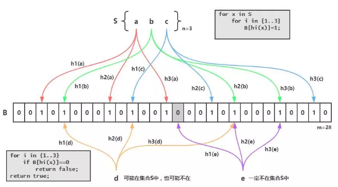

# 概念

布隆过滤器可以用于检索一个元素是否在一个集合中。它的优点是空间效率和查询时间都远远超过一般的算法，缺点是有一定的误识别率和删除困难。

# 原理

布隆过滤器的原理是，当一个元素被加入集合时，通过K个散列函数将这个元素映射成一个位数组中的K个点，把它们置为1。检索时，我们只要看看这些点是不是都是1就（大约）知道集合中有没有它了：如果这些点有任何一个0，则被检元素一定不在；如果都是1，则被检元素很可能在。这就是布隆过滤器的基本思想。

Bloom Filter跟单哈希函数Bit-Map不同之处在于：Bloom Filter使用了k个哈希函数，每个字符串跟k个bit对应。从而降低了**冲突的概率**。

# 场景

先查询缓存，缓存不命中再查询数据库。然后将查询结果放在缓存中即使数据不存在，也需要创建一个缓存，用来防止穿库。当用户量太大时，我们会缓存大量数据空数据。

k-v，存在的键值缓存布隆过滤器里面。当一个k过来，判断是否存在，不存在的话，肯定是没有缓存到的，就直接返回一个空。即使误判存在了，但是再次查询数据库，也是返回空。

问题： 要预先把所有的K存在布隆过滤器？提前将真实正确的商品Id，在添加完成之后便加入到过滤器当中

# Bloom Filter的缺点
bloom filter之所以能做到在时间和空间上的效率比较高，是因为牺牲了判断的准确率、删除的便利性

- 存在误判，可能要查到的元素并没有在容器中，但是hash之后得到的k个位置上值都是1。如果bloom filter中存储的是黑名单，那么可以通过建立一个白名单来存储可能会误判的元素。
> 也就是把误判的k缓存到一个白名单上。

- 删除困难。一个放入容器的元素映射到bit数组的k个位置上是1，删除的时候不能简单的直接置为0，可能会影响其他元素的判断。

- [Redis-避免缓存穿透的利器之BloomFilter](https://juejin.im/post/5db69365518825645656c0de)

> 不存在的肯定不存在，存在的不一定存在。思路要倒转一下。
