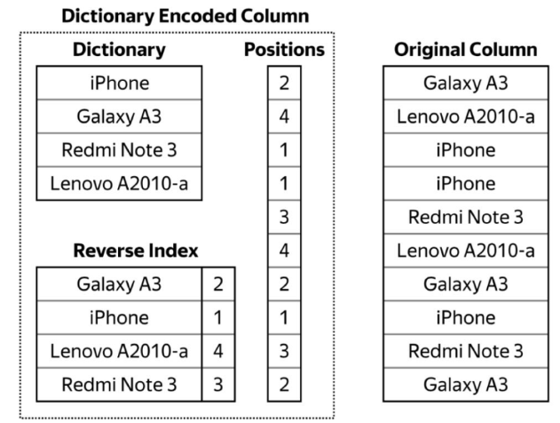

## LowCardinality Data Type

将其他数据类型的内部表示更改为字典编码

### Syntax

`LowCardinality(data_type)`

低基数是改变数据存储方法和数据处理规则的上层结构。ClickHouse将[字典编码](https://baike.baidu.com/item/%E8%AF%8D%E5%85%B8%E7%BC%96%E7%A0%81/4097538)应用于低基数列。使用字典编码的数据可以显著提高许多应用程序的SELECT查询的性能。

使用低基数数据类型的效率取决于数据的多样性。如果一个字典包含的不同值少于10000个，那么ClickHouse通常显示出更高的数据读取和存储效率。如果一个字典包含超过100000个不同的值，那么与使用普通数据类型相比，ClickHouse的性能会更差。


```sql

CREATE TABLE test2
(
    `id` UInt32,
    `v1` String,
    `v2` StringWithDictionary
)
ENGINE = MergeTree()
ORDER BY id


INSERT INTO test2 WITH
    (
        SELECT ['A', 'B', 'C', 'D']
    ) AS dict
SELECT
    number,
    dict[(number % 4) + 1] AS v1,
    v1
FROM system.numbers
LIMIT 300000000


SELECT
    column,
    any(type) AS type,
    sum(column_data_compressed_bytes) AS compressed,
    formatReadableSize(sum(column_data_compressed_bytes)) AS compressed_f,
    sum(column_data_uncompressed_bytes) AS uncompressed,
    formatReadableSize(sum(column_data_uncompressed_bytes)) AS uncompressed_f,
    sum(rows) AS rows
FROM system.parts_columns
WHERE (table = 'test2') AND (column LIKE 'v%') AND active
GROUP BY column
ORDER BY column ASC
```


┌─column─┬─type───────┬─compressed─┬─compressed_f─┬─uncompressed─┬─uncompressed_f─┬───────rows─┐
│ v1     │ String                 │    9894228 │ 9.44 MiB     │   2168623320 │ 2.02 GiB       │ 1084311660 │
│ v2     │ LowCardinality(String) │    5305899 │ 5.06 MiB     │   1087695754 │ 1.01 GiB       │ 1084311660 │
└────────┴────────────────────────┴────────────┴──────────────┴──────────────┴────────────────┴────────────┘

2 rows in set. Elapsed: 0.006 sec. Processed 1.05 thousand rows, 394.61 KB (186.18 thousand rows/s., 69.97 MB/s.)

```sql
SELECT
    v1,
    count()
FROM test2
GROUP BY v1
ORDER BY v1 ASC
```

4 rows in set. Elapsed: 2.456 sec. Processed 300.00 million rows, 3.00 GB (122.16 million rows/s., 1.22 GB/s.)

```sql
SELECT
    v2,
    count()
FROM test2
GROUP BY v2
ORDER BY v2 ASC
```

4 rows in set. Elapsed: 0.842 sec. Processed 300.00 million rows, 300.30 MB (356.50 million rows/s., 356.85 MB/s.)


在默认的情况下，声明了LowCardinality的字段会基于数据生成一个全局字典，并利用倒排索引建立Key和位置的对应关系。如果数据的基数大于 8192，也就是说不同的值多于8192个，则会将一个全局字典拆分成多个局部字典(由 low_cardinality_max_dictionary_size 参数控制, 默认8192)。

**因为进一步使用了字典压缩，所以查询的IO压力变小了，这是一处优化; 其次在处理数据的某些场合，可以直接使用字典进行操作，不需要将数据全部展开。**

由于字典压缩和数据特征息息相关，所以这项特性的最终受益效果，需要在大家各自的环境中进行验证。通常来说，在**百万级别基数的数据**下，使用LowCardinality的收益效果都是不错的。

---

LowCardinality 支持 String、Number、Date、DateTime、Nullable数据类型。

在内部，ClickHouse 创建一个或多个文件以存储 LowCardinality 字典数据。如果所有 LowCardinality 列都符合 8192 个不同的值，那么每个表可以是一个单独的文件，如果去重值的数量更多，则每个 LowCardinality 列就使用一个文件。

ClickHouse LowCardinality 优化不仅限于存储，它还使用字典 position 进行过滤、分组和加速某些查询功能（例如 length()）等。这就是为什么我们在 Query 1 中看到的改进要比纯粹从存储效率提升的效果更大的原因。在分布式查询中，ClickHouse 还将尝试在大多数查询处理中对词典 position 进行操作。



### LowCardinality 与 Enum

值得一提的是，还有一种用字典编码字符串的可能性，那就是枚举类型：Enum。

ClickHouse 完全支持枚举。从存储的角度来看，它可能甚至更高效，因为枚举值存储在表定义上而不是存储在单独的数据文件中。枚举适用于静态字典。但是，如果插入了原始枚举之外的值，ClickHouse 将抛出异常。枚举值中的每个更改都需要 ALTER TABLE，这可能会带来很多麻烦。LowCardinality 在这方面要灵活得多。

在处理字符串时，请考虑使用LowCardinality而不是Enum。低基数在使用中提供了更大的灵活性，并且通常显示出相同或更高的效率


## 参考链接

- [LowCardinality 数据类型的神秘之旅](https://blog.csdn.net/jiangshouzhuang/article/details/103268340)
- [ClickHouse中的低基数字段优化](https://mp.weixin.qq.com/s/XKQk4hsdj8VN8TnYdrOnuw)
- [lowcardinality](https://clickhouse.tech/docs/en/sql-reference/data-types/lowcardinality/)

---
## 对比测试

SELECT ['A', 'B', 'C', 'D', 'E', 'F', 'G', 'H']

┌─column─┬─type───────────────────┬─compressed─┬─compressed_f─┬─uncompressed─┬─uncompressed_f─┬───────rows─┐
│ v1     │ String                 │    9787969 │ 9.33 MiB     │   2082642630 │ 1.94 GiB       │ 1041321315 │
│ v2     │ LowCardinality(String) │    5158745 │ 4.92 MiB     │   1044511601 │ 996.12 MiB     │ 1041321315 │
└────────┴────────────────────────┴────────────┴──────────────┴──────────────┴────────────────┴────────────┘

SELECT ['a', 'b', 'c', 'd', 'e', 'f', 'g', 'h', 'i', 'j', 'k', 'l', 'm', 'n', 'o', 'p', 'q', 'r', 's', 't', 'u', 'v', 'w', 'x', 'y', 'z']

┌─column─┬─type───────────────────┬─compressed─┬─compressed_f─┬─uncompressed─┬─uncompressed_f─┬───────rows─┐
│ v1     │ String                 │   20403033 │ 19.46 MiB    │   4081169400 │ 3.80 GiB       │ 2040584700 │
│ v2     │ LowCardinality(String) │   12390096 │ 11.82 MiB    │   2046680041 │ 1.91 GiB       │ 2040584700 │
└────────┴────────────────────────┴────────────┴──────────────┴──────────────┴────────────────┴────────────┘

结论： 基数变多没有什么太大区别，对一些长字符的优化更明显。


---
- [allow_suspicious_low_cardinality_types](https://clickhouse.tech/docs/en/operations/settings/settings/#allow_suspicious_low_cardinality_types)

allow_suspicious_low_cardinality_types: 允许或限制将LowCardinality用于固定大小为8个字节或更少的数据类型：数字数据类型和FixedString（8_bytes_or_less）。

对于较小的固定值，使用**低基数通常效率低下**，因为ClickHouse为每一行存储一个数字索引:
- 磁盘空间使用量可能会增加。
- RAM消耗可能更高，具体取决于字典大小。
- 由于额外的编码/编码操作，某些功能的运行速度可能较慢。

由于上述所有原因，MergeTree引擎表中的合并时间可能会增加。

Possible values:
- 1 — Usage of LowCardinality is not restricted.
- 0 — Usage of LowCardinality is restricted.

Default value: 0.


---
# 生产案例

area    String  6,753,766,101	    6.29 GiB    24,213,036,473	    22.55 GiB   5,401,999,696

```sql

alter table ad_log add column area_d StringWithDictionary  default  area;

optimize table ad_log final
```

mt  ad_log  247.42 MiB  2.12%   100	0.10	100	2020-07-29	2020-12-13	2020-12-13 13:56:22

mt  ad_log  274.31 MiB  2.34%   100	0.11	101	2020-07-29	2020-12-13

│ area           │ String                 │   68923414 │ 65.73 MiB    │    225413587 │ 214.97 MiB     │ 49741537 │
│ area_d         │ LowCardinality(String) │   27720251 │ 26.44 MiB    │     51969474 │ 49.56 MiB      │ 49741537 │


压缩率： 26/66 =40%， 50/215=23%


`alter table ad_log MODIFY column area StringWithDictionary;`

│ area           │ LowCardinality(String) │   27720589 │ 26.44 MiB    │     51969636 │ 49.56 MiB      │ 49741547 │

`alter table ad_log drop column area_d;`

mt  ad_log  208.35 MiB  1.79%   100	0.09	100	2020-07-29	2020-12-13	2020-12-13 14:03:20

> 节省了 247-208=39M 也就是area字段的节省率： 65 - 26 = 39M。

```sql
ALTER TABLE ad_log
    MODIFY COLUMN `format` UInt16
```

│ format         │ Int32                  │   25517461 │ 24.34 MiB    │    198966212 │ 189.75 MiB     │ 49741553 │

│ format         │ UInt16                 │   18528476 │ 17.67 MiB    │     99483246 │ 94.87 MiB      │ 49741623 │

```sql
ALTER TABLE ad_log
    MODIFY COLUMN `channel` LowCardinality(UInt32)
```

│ channel        │ UInt32                 │   13599106 │ 12.97 MiB    │    198966492 │ 189.75 MiB     │ 49741623 │

│ channel        │ LowCardinality(UInt32) │    7708302 │ 7.35 MiB     │     49901555 │ 47.59 MiB      │ 49741623 │

> 7.35/12.97 = 56.7%。 47.59/189.75 = 25.08%

```sql
ALTER TABLE ad_log
    MODIFY COLUMN `channel` LowCardinality(UInt16)
```

│ channel        │ LowCardinality(UInt16) │    7708109 │ 7.35 MiB     │     49901077 │ 47.59 MiB      │ 49741623 │

```sql
ALTER TABLE ad_log
    MODIFY COLUMN `channel` UInt16
```

│ channel        │ UInt16                 │   10776842 │ 10.28 MiB    │     99483246 │ 94.87 MiB      │ 49741623 │

> 结论： 字段类型选择还是要精打细算。没必要设较大的字段类型浪费多余空间。通过LowCardinality(UInt32)，还是有很大的节省空间的。特别是未解压的数据，这些可以加快数据过滤和聚合等，不需要提前展开数据。

---

│ media_id    │ UInt32   │  707128346 │ 674.37 MiB   │   1228238476 │ 1.14 GiB       │ 307059619 │
│ format      │ UInt32   │  415450638 │ 396.20 MiB   │   1228238476 │ 1.14 GiB       │ 307059619 │
│ platform    │ UInt32   │  378096802 │ 360.58 MiB   │   1228238476 │ 1.14 GiB       │ 307059619 │

```sql
ALTER TABLE _ad_effect_shadow_app
    MODIFY COLUMN `app_id` LowCardinality(UInt32)
```
│ media_id    │ LowCardinality(UInt32) │  271709799 │ 259.12 MiB   │    308517775 │ 294.23 MiB     │ 307059619 │
│ format      │ LowCardinality(UInt32) │  147651301 │ 140.81 MiB   │    307741211 │ 293.48 MiB     │ 307059619 │
│ platform    │ LowCardinality(UInt32) │  142358249 │ 135.76 MiB   │    307699475 │ 293.45 MiB     │ 307059619 │

mt  _ad_effect_shadow_app   6.44 GiB    56.7%   732	0.39	1,100	2018-11-30	2020-11-30	2020-12-09 02:18:06

mt  _ad_effect_shadow_app   5.57 GiB    53.09%  732	0.40	1,099	2018-11-30	2020-11-30	2020-12-13 14:27:46

## 速度对比


```sql
alter table _ad_effect_shadow_app add column media_id_row UInt32  default  media_id;
optimize table _ad_effect_shadow_app final;
-- 0 rows in set. Elapsed: 126.632 sec.
```

```sql

SELECT count(1)
FROM _ad_effect_shadow_app
WHERE media_id IN (1, 2, 3)
```

┌─count(1)─┐
│   315096 │
└──────────┘

1 rows in set. Elapsed: 0.945 sec.
1 rows in set. Elapsed: 0.934 sec.
1 rows in set. Elapsed: 0.948 sec.
5629f20dd9f9 :)

```sql

SELECT count(1)
FROM _ad_effect_shadow_app
WHERE media_id_row IN (1, 2, 3)
```

1 rows in set. Elapsed: 1.462 sec.
1 rows in set. Elapsed: 1.462 sec.
1 rows in set. Elapsed: 1.499 sec.


