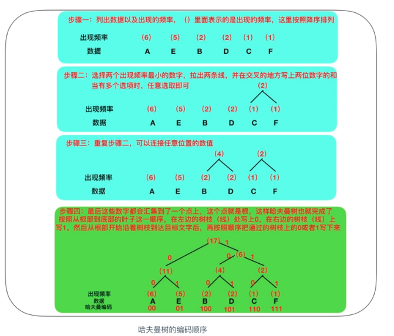
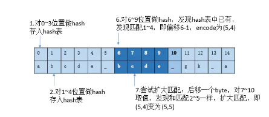

## 有损和无损

无损压缩：能够无失真地从压缩后的数据重构，准确地还原原始数据。可用于对数据的准确性要求严格的场合，如可执行文件和普通文件的压缩、磁盘的压缩，也可用于多媒体数据的压缩。该方法的压缩比较小。如差分编码、RLE、Huffman编码、LZW编码、算术编码。

有损压缩：有失真，不能完全准确地恢复原始数据，重构的数据只是原始数据的一个近似。可用于对数据的准确性要求不高的场合，如多媒体数据的压缩。该方法的压缩比较大。例如预测编码、音感编码、分形压缩、小波压缩、JPEG/MPEG。


# RLE

游程编码 Run Length Encoding

AAAAAABBCDDEEEEEF 的17个字符成功被压缩成了 A6B2C1D2E5F1 的12个字符，也就是 12 / 17 = 70%，压缩比为 70%，压缩成功了。

像这样，把文件内容用 数据 * 重复次数 的形式来表示的压缩方法成为 RLE(Run Length Encoding, 行程长度编码) 算法。RLE 算法是一种很好的压缩方法，经常用于压缩传真的图像等。因为图像文件的本质也是字节数据的集合体，所以可以用 RLE 算法进行压缩

简言之，其优点在于将重复性高的数据量压缩成小单位；然而，其缺点在于─若该数据出现频率不高，可能导致压缩结果数据量比原始数据大

# 哈夫曼算法和莫尔斯编码

莫尔斯编码一般把文本中出现最高频率的字符用短编码 来表示。

哈夫曼算法的关键就在于 多次出现的数据用小于 8 位的字节数表示，不常用的数据则可以使用超过 8 位的字节数表示。

哈夫曼算法是指，为各压缩对象文件分别构造最佳的编码体系，并以该编码体系为基础来进行压缩。因此，用什么样的编码（哈夫曼编码）对数据进行分割，就要由各个文件而定。用哈夫曼算法压缩过的文件中，存储着哈夫曼编码信息和压缩过的数据。

而在哈夫曼算法中，通过借助哈夫曼树的构造编码体系，即使在不使用字符区分符号的情况下，也可以构建能够明确进行区分的编码体系。不过哈夫曼树的算法要比较复杂，下面是一个哈夫曼树的构造过程。


自然界树的从根开始生叶的，而哈夫曼树则是叶生枝

使用哈夫曼树之后，出现频率越高的数据所占用的位数越少，这也是哈夫曼树的核心思想。

# Delta encoding
差分编码（英语：Delta encoding），又称增量编码，是指在序列式数据之间以数据差异形式存储或发送数据的方式（相对于存储发送完整文件的方式）。差分编码应用广泛，如需要查看文件的历史更改记录（版本控制、git等）、Windows中的远程差分压缩、在线备份等场景均用到了差分编码。

差异存储在称为“delta”或“diff”的不连续文件中。由于改变通常很小（平均占全部大小的2%），差分编码能大幅减少数据的重复。一连串独特的delta文件在空间上要比未编码的相等文件有效率多了。

差分编码的简单例子是存储序列式数据之间的差异（而不是存储数据本身）：不存“2, 4, 6, 9, 7”，而是存“2, 2, 2, 3, -2”。单独使用用处不大，但是在序列式数值常出现时可以帮助压缩数据。


---
# LZW

 LZW算法中，首先建立一个字符串表，把每一个第一次出现的字符串放入串表中，并用一个数字来表示，这个数字与此字符串在串表中的位置有关，并将这个数字存入压缩文件中，如果这个字符串再次出现时，即可用表示它的数字来代替，并将这个数字存入文件中。压缩完成后将串表丢弃。如"print" 字符串，如果在压缩时用266表示，只要再次出现，均用266表示，并将"print"字符串存入串表中，在图象解码时遇到数字266，即可从串表中查出266所代表的字符串"print"，在解压缩时，串表可以根据压缩数据重新生成。

特殊标记：
       随着新的串(string)不断被发现，标号也会不断地增长，如果原数据过大，生成的标号集（string table)会越来越大，这时候操作这个集合就会产生效率问题。如何避免这个问题呢?Gif在采用lzw算法的做法是当标号集足够大的时候，就不能增大了，干脆从头开始再来，在这个位置要插入一个标号，就是清除标志CLEAR，表示从这里我重新开始构造字典，以前的所有标记作废，开始使用新的标记。

---
# lz4
lz4是目前综合来看效率最高的压缩算法，更加侧重压缩解压速度，压缩比并不是第一。在当前的安卓和苹果操作系统中，内存压缩技术就使用的是lz4算法，及时压缩手机内存以带来更多的内存空间。本质上是时间换空间。

```
输入：fghabcde_bcdefgh_abcdefghxxxxxxx
输出：fghabcde_(5,4)(13,3)_(14,5)fghxxxxxxx
格式：[token]literals(offset,match length)[token](offset,match length)....
这里(13,3)长度3其实并不对，match length匹配的长度默认是4
```

其中两个括号内的便代表的是压缩时检测到的重复项，(5,4) 代表向前5个byte，匹配到的内容长度有4，即"bcde"是一个重复。当然也可以说"cde"是个重复项，但是根据算法实现的输入流扫描顺序，我们取到的是第一个匹配到的，并且长度最长的作为匹配。


Literals指没有重复、首次出现的字节流，即不可压缩的部分
Match指重复项，可以压缩的部分
Token记录literal长度，match长度。作为解压时候memcpy的参数

## 压缩率

可以想到，如果重复项越多或者越长，压缩率就会越高。上述例子中"bcde"在压缩后，用(5,4)表示，即从4个bytes压缩成了3个bytes来表示，其中offset 2bytes, match length 1byte，能节省1个byte。

## 压缩算法实现
大致流程，压缩过程以**至少4个bytes为扫描窗口查找匹配**，每次移动1byte进行扫描，遇到重复的就进行压缩。
由于offset用2bytes表示，只能查找到到2^16(64kb)距离的匹配，对于压缩4Kb的内核页，只需要用到12位。
扫描的步长1byte是可以调整的，即对应LZ4_compress_fast机制，步长变长可以提高压缩解压速度，减少压缩率。



## 解压算法
根据解压前的数据流，取出token内的length，literals直接复制到输出，即memcpy(src,dst,length)
遇到match，在从前面已经拷贝的literals复制到后面即可

> 使用者： ES、clickhouse

---
参考链接：

- [深入解析数据压缩算法](https://blog.csdn.net/fanyun_01/java/article/details/80211799)
- [程序员需要了解的硬核知识之压缩算法](https://segmentfault.com/a/1190000020921942#item-2-6)
- [差分编码](https://zh.wikipedia.org/wiki/%E5%B7%AE%E5%88%86%E7%B7%A8%E7%A2%BC)
- [深入浅出lz4压缩算法](https://www.jianshu.com/p/824e1cf4f920)
- [lz4](https://github.com/lz4/lz4/)
